# {功能名稱} 後端功能規格書

<!--
  文件定位：
  - 本文件為「後端功能規格書」，專注於後端實作細節
  - 前置文件：功能需求文件範本（FRD）定義了 What 和 Why
  - 本文件定義：How - 後端如何實作需求
  - 後續文件：前端功能規格書 - 前端如何使用 API

  參考標準：
  - IEEE 830-1998 Software Requirements Specification
  - ISO/IEC/IEEE 29148:2018 Requirements Engineering
  - ISO/IEC 25010:2023 Software Product Quality Model

  使用說明：
  1. 將 {佔位符} 替換為實際內容
  2. 根據功能類型刪除不適用的章節
  3. 保持章節編號連續性

  命名規範（重要）：
  - 資料模型屬性：語義化 PascalCase 命名
  - Request 屬性：PascalCase + 語義化命名
  - Response 屬性：PascalCase + 巢狀物件（參照欄位使用 Light Response）
  - JSON 輸出：camelCase（框架自動轉換）

  巢狀物件命名慣例（參照實際程式碼）：
  - 廠商：Vendor → GetLightVendorResponse { VendorId, VendorName }
  - 幣別：Currency → CurrencyInfo { Code, Name }
  - 工別：ProcessType → GetLightProcessTypeResponse { Id, ProcessTypeCode, ProcessTypeName }
  - 模具：Mold → GetLightMoldResponse { MoldId, MoldNo, MoldName }
  - 零件：Part → GetLightPartResponse { Id, PartNo, PartName }
  - 訂單：SalesOrder → GetLightSalesOrderResponse { SalesOrderId, SalesOrderNo }
  - 製程序號：ProcessSequence（flat string，非巢狀）
  - 修改時間：LastModifiedTime（非 LastModifiedDate）

  參考範例：參考同模組已完成的規格書以保持格式和內容深度一致
-->

---

## 文件資訊

| 項目 | 內容 |
|------|------|
| 文件編號 | BFS-{模組代號}-{序號} |
| 版本 | 1.0 |
| 狀態 | 草稿 / 審查中 / 已核准 |
| 建立日期 | YYYY-MM-DD |
| 最後更新 | YYYY-MM-DD |
| 撰寫者 | {姓名} |
| 審核者 | {姓名} |

### 修訂歷史

| 版本 | 日期 | 修訂者 | 變更說明 |
|------|------|--------|----------|
| 1.0 | YYYY-MM-DD | {姓名} | 初版建立 |

### 規格狀態

| 項目 | 狀態 | 說明 |
|------|------|------|
| 規格完成度 | 草稿 / 審查中 / 已核准 | |
| 驗證結果 | 未驗證 / 驗證中 / 已通過 | |
| 待確認項 | 所有疑問已釐清 / 尚有 {N} 項待確認 | |

---

## 1. 需求概述

### 1.1 功能目的

<!--
說明：從功能需求文件（FRD）延續，簡述此功能的後端實作目的
-->

| 項目 | 說明 |
|------|------|
| 對應需求文件 | FRD-{編號} |
| 功能目的 | {描述此後端功能要達成的目標} |
| 業務價值 | {說明這個功能為業務帶來的價值} |

### 1.2 功能範圍

**後端實作範圍：**
- {功能項目 1}
- {功能項目 2}
- {功能項目 3}

**不在本規格範圍：**
- {排除項目 1}
- {排除項目 2}

### 1.3 涉及系統與資料表

| 系統 | 角色 | 主要資料表 | 說明 |
|------|------|-----------|------|
| MP | 資料來源/目的 | `{Schema}.{Table1}` | {說明} |
| MP | 資料來源/目的 | `{Schema}.{Table2}` | {說明} |
| MP (Shadow) | 狀態追蹤 | `Erp.{Name}Shadow` | 同步狀態追蹤 |
| 中介資料庫 | 資料交換 | `{中介表}` | 跨系統整合 |
| ERP | 資料目的 | - | 外部系統 |

### 1.4 前置條件與假設

| 類型 | 描述 |
|------|------|
| 前置條件 | {系統或資料必須滿足的條件} |
| 假設 | {開發時的假設條件} |
| 相依性 | {依賴的其他模組或服務} |

---

## 2. 業務邏輯

### 2.1 核心業務規則

<!--
說明：定義此功能的核心業務邏輯，使用結構化方式呈現
-->

| 規則編號 | 規則名稱 | 規則描述 | 觸發時機 | 優先級 |
|----------|----------|----------|----------|--------|
| BL-001 | {規則名稱} | {詳細的業務規則描述} | {新增/修改/刪除/查詢} | 高/中/低 |
| BL-002 | {規則名稱} | {詳細的業務規則描述} | {觸發時機} | 高/中/低 |
| BL-003 | {規則名稱} | {詳細的業務規則描述} | {觸發時機} | 高/中/低 |

### 2.2 業務規則詳細說明

#### BL-001：{規則名稱}

| 項目 | 說明 |
|------|------|
| 規則目的 | {為什麼需要這個規則} |
| 判斷條件 | {詳細的邏輯條件，可使用虛擬碼} |
| 執行動作 | {條件成立時的處理方式} |
| 例外處理 | {條件不成立時的處理方式} |
| 錯誤訊息 | 「{顯示給使用者的訊息}」 |

**判斷邏輯（虛擬碼）：**

```
IF {條件A} AND {條件B} THEN
    {執行動作1}
ELSE IF {條件C} THEN
    {執行動作2}
ELSE
    THROW ERROR "{錯誤訊息}"
END IF
```

### 2.3 狀態轉換邏輯

<!--
說明：如果資料有狀態變化，定義狀態轉換規則
-->

| 當前狀態 | 觸發事件 | 目標狀態 | 前置條件 | 後續動作 |
|----------|----------|----------|----------|----------|
| {狀態A} | {事件1} | {狀態B} | {必須滿足的條件} | {狀態變更後的動作} |
| {狀態B} | {事件2} | {狀態C} | {必須滿足的條件} | {狀態變更後的動作} |

### 2.4 計算邏輯

<!--
說明：如果有金額計算、數量計算等邏輯
-->

| 計算項目 | 計算公式 | 說明 |
|----------|----------|------|
| {項目名稱} | `{欄位A} * {欄位B}` | {計算說明} |
| {項目名稱} | `SUM({明細欄位})` | {計算說明} |

---

## 3. 資料流程

### 3.1 整體資料流程圖

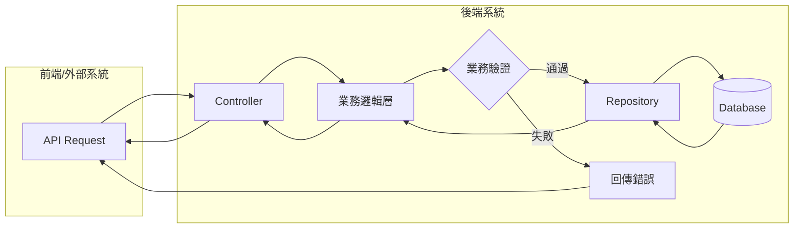

### 3.2 新增資料流程

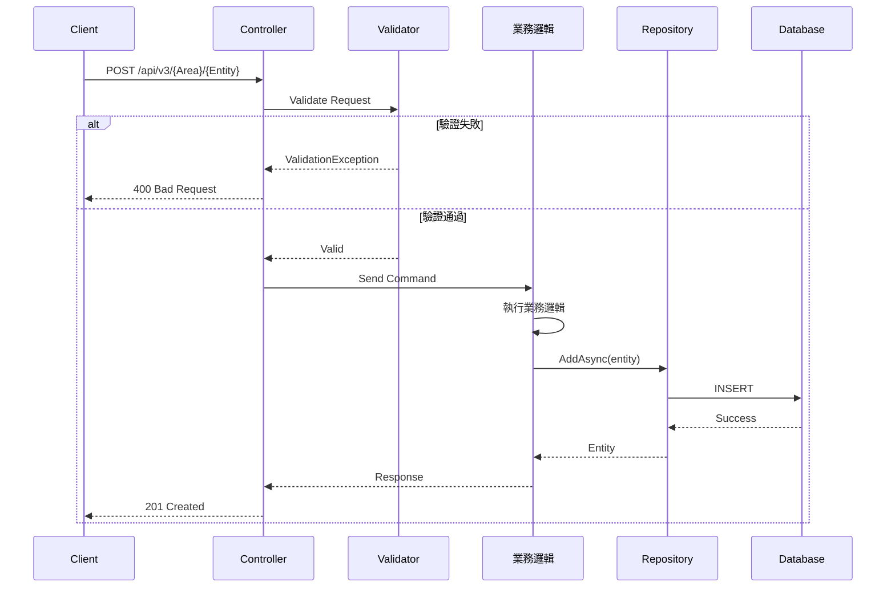

### 3.3 修改資料流程

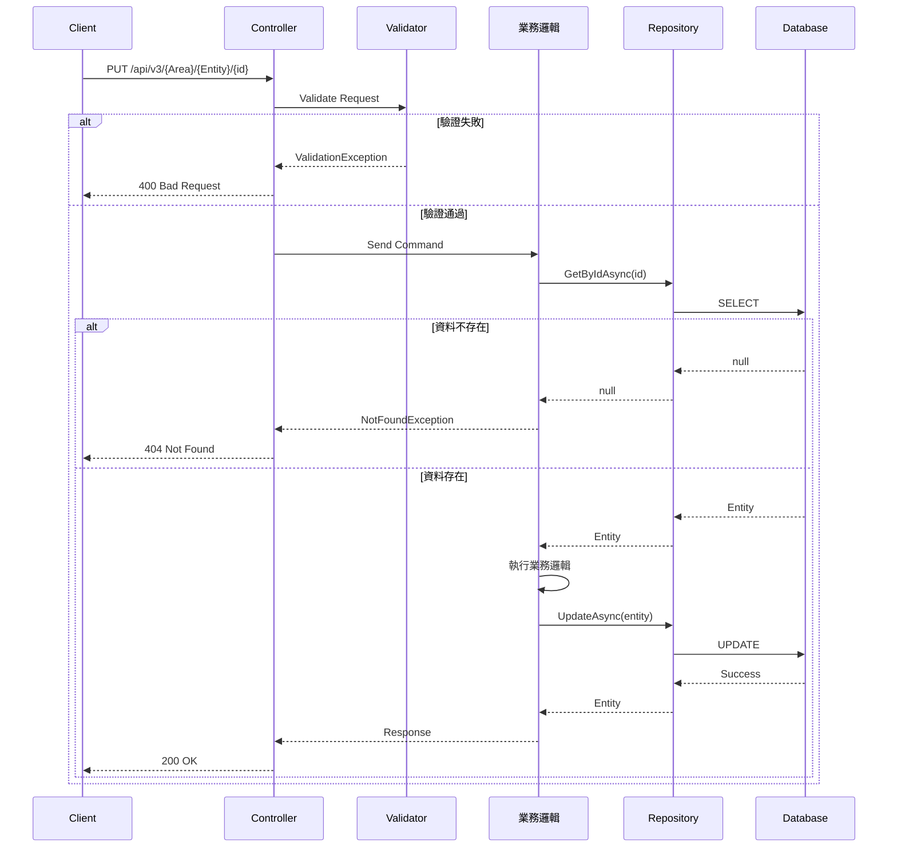

### 3.4 刪除資料流程

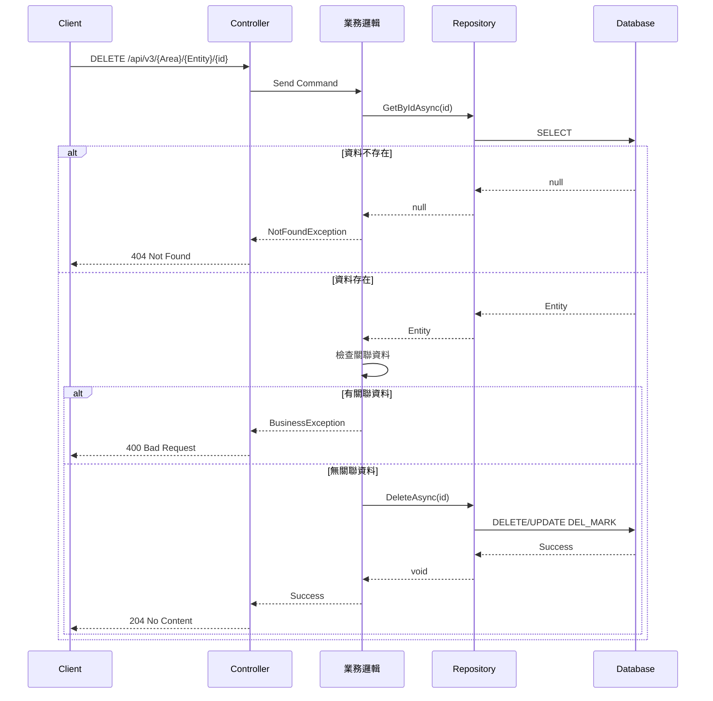

### 3.5 查詢資料流程

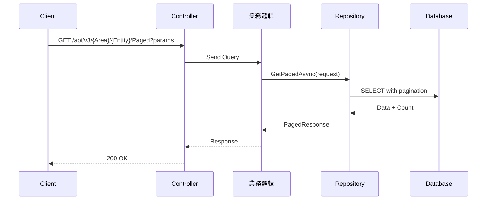

---

## 4. 業務流程圖

### 4.1 主要業務流程

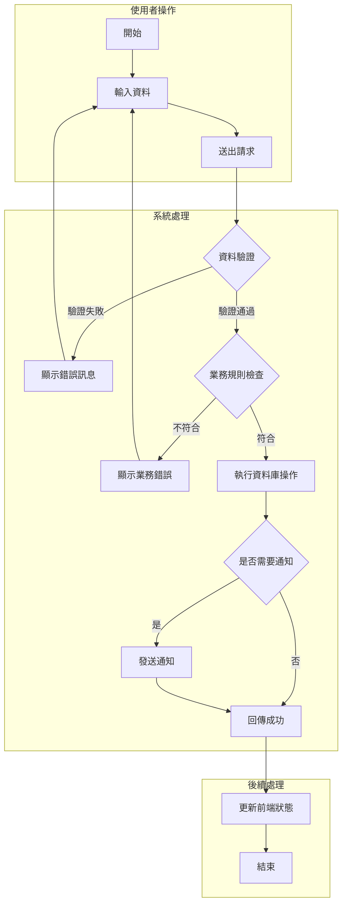

### 4.2 狀態流程圖

<!--
說明：如果功能涉及狀態變化，使用狀態圖呈現
-->

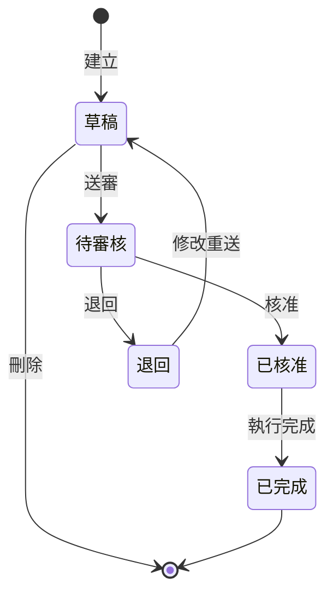

### 4.3 排程同步流程（若適用）

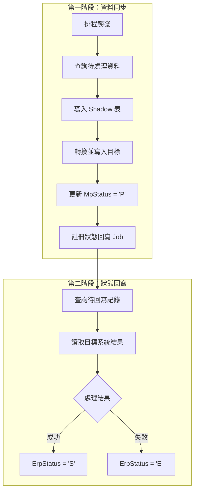

---

## 5. 資料模型

### 5.1 資料庫關聯圖 (ER Diagram)

<!--
說明：使用 Mermaid erDiagram 展示資料表之間的關聯關係
-->

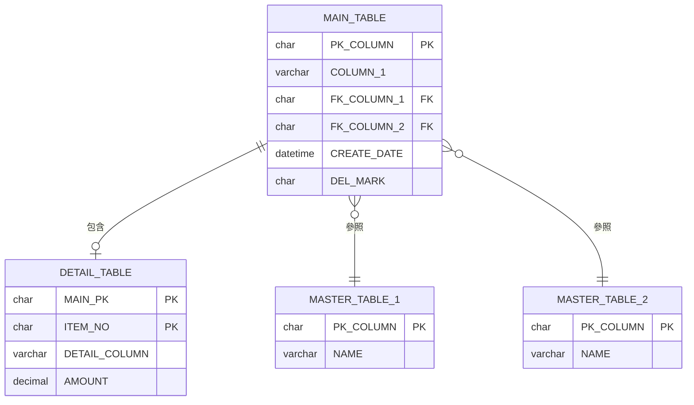

> **註**：請將 `MAIN_TABLE`、`DETAIL_TABLE` 等替換為實際資料表名稱

**關聯說明：**

| 主表 | 關聯 | 從表 | 說明 |
|------|------|------|------|
| `MAIN_TABLE` | 1:N | `DETAIL_TABLE` | 主檔對明細 |
| `MAIN_TABLE` | N:1 | `MASTER_TABLE_1` | 參照主檔 |
| `MAIN_TABLE` | N:1 | `MASTER_TABLE_2` | 參照主檔 |

### 5.2 Entity 類別關聯圖

<!--
說明：使用 Mermaid classDiagram 展示 C# Entity 之間的關係
-->

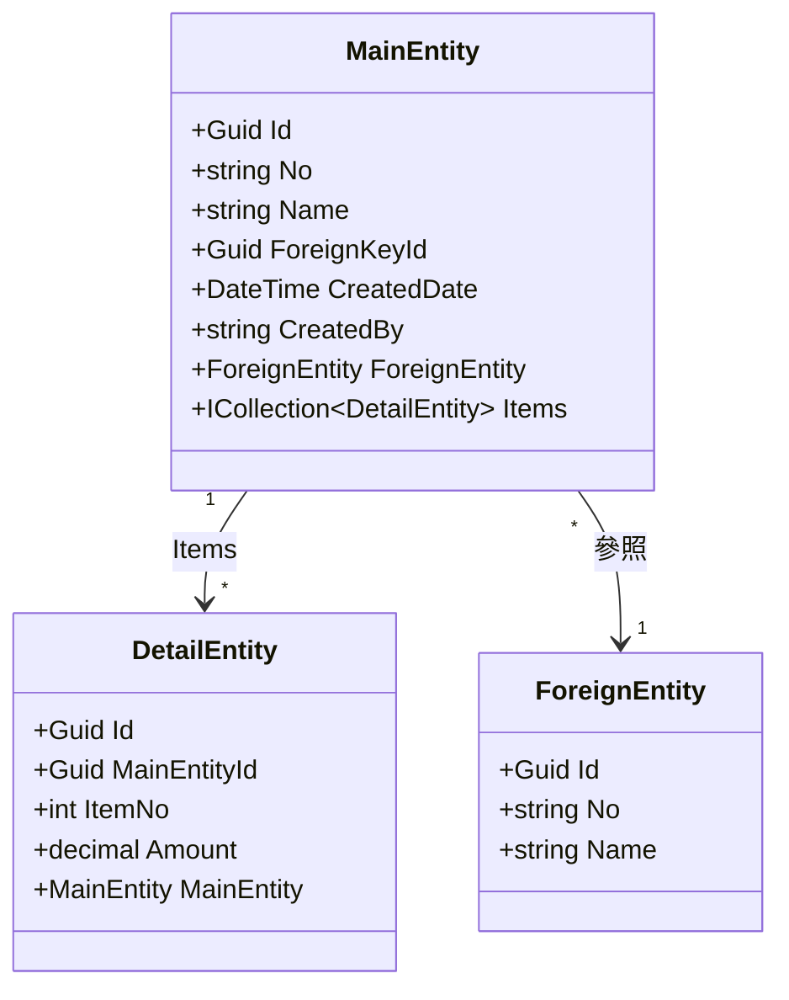

> **註**：請將 `MainEntity`、`DetailEntity`、`ForeignEntity` 替換為實際 Entity 名稱

### 5.3 資料轉換流程

<!--
說明：展示從資料庫到 Entity 再到 DTO/Response 的轉換流程
-->

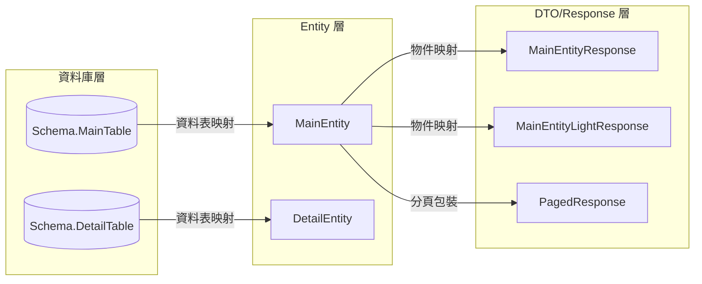

> **註**：請將圖中名稱替換為實際的 Schema、Table、Entity 名稱

**欄位對應總覽：**

<!--
說明：四欄對應表，展示從 DB 到 API 的完整欄位映射鏈
- DB 欄位：資料庫實際欄位名（UPPER_SNAKE_CASE）
- Entity 屬性：C# Entity 類別屬性名（PascalCase）
- Request 屬性：C# Request DTO 屬性名（PascalCase，語義化命名）
- Response 屬性：JSON 輸出屬性名（camelCase，因 .NET 預設 JSON 序列化）

命名規則：
- Entity 屬性：語義化 PascalCase + [Column("DB_COLUMN")] 映射，如 CUST_NO → VendorNo [Column("CUST_NO")]、DATE1 → ReceiptDate [Column("DATE1")]
- Request 屬性：語義化命名，如 CUST_NO → VendorId（參照 CreatePurchaseOrderRequest 慣例）
- Response 屬性：語義化 + 巢狀物件，如 CUST_NO → vendor { vendorId, vendorName }（參照 GetLightVendorResponse）
- 日期欄位：語義化命名，如 DATE1 → receiptDate / purchaseDate（非 date）
- 修改時間：MOD_DATE/UTIME → lastModifiedTime（非 lastModifiedDate，參照 GetPurchaseOrderResponse）
- 沖轉帶入欄位：Request 標示「（沖轉帶入）」，表示由系統自動填入，非使用者輸入
-->

#### 表頭欄位對應

| DB 欄位 | Entity 屬性 | Request 屬性 | Response 屬性 | 說明 |
|---------|-------------|-------------|---------------|------|
| `PK_COLUMN` | `PkId` | （自動產生） | `pkId` | 主鍵（語義化） |
| `CUST_NO` | `VendorNo` | `VendorId` | `vendor.vendorId` + `vendor.vendorName` | 廠商 → 巢狀物件 |
| `DATE1` | `ReceiptDate` | `ReceiptDate` | `receiptDate` | 日期（語義化） |
| `NAME` | `PartName` | `PartName` | `partName` | 名稱（語義化） |

#### 明細欄位對應

| DB 欄位 | Entity 屬性 | Request 屬性 | Response 屬性 | 說明 |
|---------|-------------|-------------|---------------|------|
| `MAIN_PK` | `MainId` | （自動帶入） | `mainId` | 主檔 FK（語義化） |
| `ITEM_NO` | `ItemNo` | （自動編號） | `itemNo` | 項次 |
| `QTY1` | `Qty1` | `Quantity` | `quantity` | 數量 |
| `AMT1` | `Amt1` | `UnitPrice` | `unitPrice` | 單價 |
| `AMT2` | `Amt2` | （自動計算） | `amount` | 金額=AMT1×QTY1 |

### 5.4 來源資料表

#### {Schema}.{Table1} - {說明}

| 欄位 | 型態 | 長度 | 說明 | 備註 |
|------|------|------|------|------|
| {PK_COLUMN} | char | 10 | {說明} | PK |
| {COLUMN} | varchar | 50 | {說明} | |
| {FK_COLUMN} | char | 10 | {說明} | FK → {關聯表} |
| DEL_MARK | char | 1 | 刪除標記 | Y=已刪除 |
| CREATER | varchar | 20 | 建立者 | |
| CREATE_DATE | datetime | - | 建立時間 | |
| MODIFYER | varchar | 20 | 修改者 | |
| MODIFY_DATE | datetime | - | 修改時間 | |

**索引：**

| 索引名稱 | 欄位 | 類型 | 說明 |
|----------|------|------|------|
| PK_{TableName} | {PK} | Clustered | 主鍵 |
| IX_{TableName}_{Column} | {Column} | Non-Clustered | 查詢優化 |

### 5.5 Entity 定義

<!--
命名規範：
- C# 屬性名一律使用語義化 PascalCase
- 舊表欄位名為 UPPER_SNAKE_CASE（如 CUST_NO），Entity 使用語義化命名 + [Column("CUST_NO")] 映射（如 VendorNo）
- 避免無意義命名（如 Date1, Amt2, Type1），改為語義化（如 ReceiptDate, TotalAmount, OutsourceType）
- 新表欄位名直接與 Entity 屬性名一致（如 GroupId），無需 [Column] 屬性
- 需標明 DB 欄位對應、資料型態、是否必填
-->

#### {Entity}.cs

| C# 屬性 | DB 欄位 | 資料型態 | 必填 | 說明 |
|---------|---------|----------|------|------|
| Id | {DB_COLUMN} | Guid | O | 系統主鍵 |
| {No} | {DB_COLUMN} | string(10) | O | 業務編號 |
| {Name} | {DB_COLUMN} | string(50) | O | 名稱 |
| {ForeignKeyId} | {DB_COLUMN} | Guid | O | 外鍵 |
| {OptionalField} | {DB_COLUMN} | string? | X | 選填欄位 |
| CreatedDate | {DB_COLUMN} | DateTime | O | 建立時間 |
| CreatedBy | {DB_COLUMN} | string | O | 建立者 |
| ModifiedDate | {DB_COLUMN} | DateTime? | X | 修改時間 |
| ModifiedBy | {DB_COLUMN} | string? | X | 修改者 |
| Items | - | ICollection\<{DetailEntity}\> | - | 明細（導航屬性） |

### 5.6 Shadow 表（若適用）

#### Erp.{Name}Shadow

| 欄位 | 型態 | 說明 | 來源 |
|------|------|------|------|
| Id | uniqueidentifier | 主鍵 | 系統產生 (GUID) |
| {業務Id} | nvarchar(10) | 業務主鍵 | `{Table}.{欄位}` |
| MpStatus | nvarchar(1) | MP 處理狀態 | 系統產生 |
| MpMessage | nvarchar(100) | 處理失敗原因 | 系統產生 |
| ErpStatus | nvarchar(1) | ERP 處理狀態 | ERP 回寫 |
| ErpMessage | nvarchar(100) | ERP 錯誤訊息 | ERP 回寫 |
| PayloadHash | char(64) | 資料指紋 | SHA256 Hex |
| IsChanged | bit | 是否有變更 | 比對 PayloadHash |
| CreatedTime | datetime | 建立時間 | 資料庫預設 |

**狀態值定義：**

| 欄位 | 值 | 說明 |
|------|---|------|
| MpStatus | 空白 | 待處理 |
| | P | 已處理，等待回寫 |
| | E | 處理失敗 |
| ErpStatus | 空白 | 待目標系統處理 |
| | S | 處理成功 |
| | E | 處理失敗 |

---

## 6. API 介面規格

<!--
章節格式說明：
- §6.1 為端點總覽表，快速瀏覽所有端點
- §6.2 起，每個端點獨立一個小節，包含：
  1. 說明：簡述端點用途
  2. Request：模型定義表格（屬性名稱使用 PascalCase）+ JSON 範例（camelCase）
  3. Response：模型定義表格（屬性名稱使用 PascalCase）+ JSON 範例（camelCase）

命名規範：
- 模型定義表格的「屬性名稱」欄使用 PascalCase（對應 C# 屬性名稱）
  例：VendorId, ReceiptDate, TaxRate, CurrencyCode, OutsourceType
- JSON 範例使用 camelCase（對應 .NET 預設 JSON 序列化行為）
  例：vendorId, receiptDate, taxRate, currencyCode, outsourceType
- 關聯實體在 Response 中以巢狀物件呈現，參照現有 Light Response 命名
  例：vendor: { vendorId, vendorName }, currency: { code, name }
  例：processType: { id, processTypeCode, processTypeName }
  例：mold: { moldId, moldNo, moldName }
- 修改時間使用 lastModifiedTime（非 lastModifiedDate）

重要原則：
- 每個端點**必須**提供完整的 JSON 範例（Request 和 Response 都要）
- JSON 範例使用擬真資料，避免使用佔位符
- 關聯實體巢狀物件優先複用現有 Light Response
-->

### 6.1 端點總覽

| 方法 | 路由 | 說明 | 權限 |
|------|------|------|------|
| GET | `/api/v3/{Area}/{Controller}` | 取得所有 {Entity} | Read |
| GET | `/api/v3/{Area}/{Controller}/{id}` | 取得單一 {Entity} | Read |
| GET | `/api/v3/{Area}/{Controller}/Paged` | 分頁查詢 | Read |
| GET | `/api/v3/{Area}/{Controller}/Light` | 輕量列表（選擇器用） | Read |
| POST | `/api/v3/{Area}/{Controller}` | 建立 {Entity} | Create |
| PUT | `/api/v3/{Area}/{Controller}/{id}` | 更新 {Entity} | Update |
| DELETE | `/api/v3/{Area}/{Controller}/{id}` | 刪除 {Entity} | Delete |

### 6.2 端點 1：GET /api/v3/{Area}/{Controller}

**說明：** 取得所有 {Entity}

**Request：** 無 Body

**Response：** `Get{Entity}Response[]`

```json
[
  {
    "id": "00000000-0000-0000-0000-000000000000",
    "{no}": "{NO_VALUE}",
    "{foreignEntity}": {
      "id": "{FK_VALUE}",
      "name": "{FK_NAME}"
    },
    "{date}": "2024-01-01",
    "{amount}": 100.50,
    "lastModifiedBy": "{USER}",
    "lastModifiedDate": "2024-01-01T10:30:00"
  }
]
```

### 6.3 端點 2：GET /api/v3/{Area}/{Controller}/{id}

**說明：** 取得單一 {Entity}（含明細）

**Request：** Path 參數 `{id}` (string/Guid)

**Response：** `Get{Entity}Response`

```json
{
  "id": "00000000-0000-0000-0000-000000000000",
  "{no}": "{NO_VALUE}",
  "{foreignEntity}": {
    "id": "{FK_VALUE}",
    "name": "{FK_NAME}"
  },
  "{date}": "2024-01-01",
  "{amount}": 100.50,
  "lastModifiedBy": "{USER}",
  "lastModifiedDate": "2024-01-01T10:30:00",
  "items": [
    {
      "{itemNo}": "01",
      "{detailField}": "{VALUE}",
      "{quantity}": 10.00,
      "{unitPrice}": 50.0000,
      "{amount}": 500.00
    }
  ]
}
```

### 6.4 端點 3：GET /api/v3/{Area}/{Controller}/Paged

**說明：** 分頁查詢

**Request：** Query 參數

```
GET /api/v3/{Area}/{Controller}/Paged?
  {filterField1}={value}&
  {dateFrom}=2024-01-01&
  {dateTo}=2024-12-31&
  Keywords={keyword}&
  CurrentPage=1&
  PagesSize=20&
  SortBy={sortField}&
  SortOrder=DESC
```

| 參數 | 型態 | 必填 | 預設值 | 說明 | 來源 |
|------|------|------|--------|------|------|
| CurrentPage | int | X | 1 | 頁碼 | 繼承自 PagedRequest |
| PagesSize | int | X | 10 | 每頁筆數（最大 100） | 繼承自 PagedRequest |
| SortBy | string[]? | X | {預設} | 排序欄位（陣列） | 繼承自 PagedRequest |
| SortOrder | string[]? | X | ["DESC"] | 排序方向（ASC/DESC 陣列） | 繼承自 PagedRequest |
| {FilterField1} | string? | X | - | 篩選：{欄位說明} | 自訂屬性 |
| {FilterField2} | Guid? | X | - | 篩選：{欄位說明} | 自訂屬性 |
| {DateFrom} | DateTime? | X | - | 日期起 | 自訂屬性 |
| {DateTo} | DateTime? | X | - | 日期迄 | 自訂屬性 |
| Keywords | string? | X | - | 關鍵字搜尋 | 自訂屬性 |

**Response：** `PagedResponse<Get{Entity}Response>`

```json
{
  "items": [
    {
      "id": "00000000-0000-0000-0000-000000000000",
      "{no}": "{NO_VALUE}",
      "{foreignEntity}": { "id": "{FK_VALUE}", "name": "{FK_NAME}" },
      "{date}": "2024-01-01",
      "{amount}": 100.50,
      "lastModifiedBy": "{USER}",
      "lastModifiedDate": "2024-01-01T10:30:00"
    }
  ],
  "totalCount": 50,
  "pagesSize": 20,
  "currentPage": 1,
  "totalPages": 3
}
```

> **注意**：`PagedResponse<T>` 的 JSON 序列化欄位僅包含 `items`、`totalCount`、`pagesSize`、`currentPage`、`totalPages`。`StartPage`、`EndPage`、`PageNumbers`、`MaxNavigationPages` 標記為 `[JsonIgnore]`，不會輸出至前端。

### 6.5 端點 4：GET /api/v3/{Area}/{Controller}/Light

**說明：** 輕量列表（選擇器用）

<!--
Light Response 設計原則：
- 僅包含 ID + 主要顯示名稱/代碼（最多 3-5 個屬性）
- 禁止包含 List<> 集合導航
- 可被其他 Response 複用作為巢狀物件
-->

**Request：** 無 Body

**Response：** `GetLight{Entity}Response[]`

```json
[
  {
    "{entity}Id": "00000000-0000-0000-0000-000000000000",
    "{entity}No": "{NO_VALUE}",
    "{entity}Name": "{NAME_VALUE}"
  }
]
```

### 6.6 端點 5：POST /api/v3/{Area}/{Controller}

**說明：** 建立 {Entity}

**Request：** `Create{Entity}Request`

| 屬性名稱 | 型態 | 必填 | 長度限制 | 說明 | 驗證規則 |
|----------|------|------|----------|------|----------|
| {PropertyName} | string | O | 50 | {說明} | VR-001 |
| {ForeignKeyNo} | string | O | 10 | {說明} | VR-002, BR-001 |
| {Date} | DateTime | O | - | {說明} | VR-003 |
| {NumericField} | decimal | O | 10,2 | {說明} | VR-004 |
| {OptionalProperty} | string? | X | 100 | {說明} | |

```json
{
  "{propertyName}": "{value}",
  "{foreignKeyNo}": "{FK_VALUE}",
  "{date}": "2024-01-01",
  "{numericField}": 100.50,
  "{optionalProperty}": null
}
```

**Response：** `Get{Entity}Response`（同端點 2 格式）

```json
{
  "id": "00000000-0000-0000-0000-000000000000",
  "{no}": "{AUTO_GENERATED_NO}",
  "{foreignEntity}": { "id": "{FK_VALUE}", "name": "{FK_NAME}" },
  "{date}": "2024-01-01",
  "{amount}": 0.00,
  "lastModifiedBy": "{USER}",
  "lastModifiedDate": "2024-01-01T10:30:00",
  "items": []
}
```

### 6.7 端點 6：PUT /api/v3/{Area}/{Controller}/{id}

**說明：** 更新 {Entity}

**Request：** `Update{Entity}Request`

| 屬性名稱 | 型態 | 必填 | 長度限制 | 說明 | 驗證規則 |
|----------|------|------|----------|------|----------|
| {PropertyName} | string | O | 50 | {說明} | VR-001 |
| {OptionalProperty} | string? | X | 100 | {說明} | VR-002 |

```json
{
  "{propertyName}": "{updated_value}",
  "{optionalProperty}": "{value}"
}
```

**Response：** `Get{Entity}Response`（同端點 2 格式）

### 6.8 端點 7：DELETE /api/v3/{Area}/{Controller}/{id}

**說明：** 刪除 {Entity}（軟刪除 DEL_MARK='Y' 或實體刪除）

**Request：** Path 參數 `{id}` (string/Guid)

**Response：** 204 No Content（成功）/ 400 Bad Request（業務錯誤）

```json
{
  "type": "business_error",
  "title": "業務規則錯誤",
  "status": 400,
  "detail": "{業務錯誤訊息}"
}
```

<!--
若有額外端點（如明細 CRUD、沖轉查詢等），依序新增 §6.9、§6.10...
每個端點都必須包含完整的 Request 模型表格 + JSON 範例 + Response JSON 範例。
-->

### 6.N 巢狀物件定義

<!--
設計原則：
- 所有關聯實體必須使用巢狀物件，禁止扁平化展開
- 優先複用現有 GetLight{Entity}Response（位於 Application/{Module}/{Entity}Service/Queries/）
- 若無現有 Light Response 可複用，建立 DTO 專屬內部類別（{DtoName}{Entity}Info）
- 巢狀物件最多 2-3 層，避免過深嵌套
-->

**巢狀物件來源判斷：**

| 情境 | 做法 | 命名規則 |
|------|------|----------|
| 現有 Light Response 存在 | 直接複用 | `GetLight{Entity}Response` |
| 現有 Light Response 不存在但通用 | 新建 Light Response | `GetLight{Entity}Response` |
| 僅此 DTO 使用的組合欄位 | 建立內部類別 | `{DtoName}{Entity}Info` |

### 6.N+1 錯誤回應格式

#### ValidationResponseModel（400 Bad Request）

```json
{
  "type": "validation",
  "title": "驗證失敗",
  "status": 400,
  "errors": {
    "{fieldName}": ["{錯誤訊息1}", "{錯誤訊息2}"]
  }
}
```

#### NotFoundResponseModel（404 Not Found）

```json
{
  "type": "not_found",
  "title": "資料不存在",
  "status": 404,
  "detail": "{Entity} with id '{id}' was not found"
}
```

#### BusinessExceptionResponseModel（400 Bad Request）

```json
{
  "type": "business_error",
  "title": "業務規則錯誤",
  "status": 400,
  "detail": "{業務錯誤訊息}"
}
```

---

## 7. 驗證規則

### 7.1 輸入驗證

| 規則編號 | 欄位 | 驗證類型 | 規則描述 | 錯誤訊息 |
|----------|------|----------|----------|----------|
| VR-001 | {欄位} | 必填 | 不可為空或空白 | `{欄位名稱} 為必填欄位` |
| VR-002 | {欄位} | 長度 | 長度不可超過 {N} | `{欄位名稱} 長度不可超過 {N} 字元` |
| VR-003 | {欄位} | 格式 | 符合 {格式說明} | `{欄位名稱} 格式不正確` |
| VR-004 | {欄位} | 範圍 | 數值須介於 {A} ~ {B} | `{欄位名稱} 須介於 {A} ~ {B} 之間` |
| VR-005 | {欄位} | 日期 | 不可為過去日期 | `{欄位名稱} 不可為過去日期` |
| VR-006 | {欄位} | 位元組長度 | varchar({N}) 限制 | `{欄位名稱} 超過資料庫欄位長度限制` |

### 7.2 業務驗證

| 規則編號 | 規則名稱 | 規則描述 | 驗證時機 | 錯誤訊息 |
|----------|----------|----------|----------|----------|
| BR-001 | 唯一性檢查 | {欄位} 不可重複 | 新增 | `{欄位} '{value}' 已存在` |
| BR-002 | 關聯檢查 | {關聯Entity} 必須存在 | 新增/修改 | `找不到關聯的 {Entity}` |
| BR-003 | 狀態檢查 | 特定狀態下不可{操作} | 修改/刪除 | `{Entity} 狀態為 {狀態}，不允許此操作` |
| BR-004 | 關聯資料限制 | 有關聯資料時不可刪除 | 刪除 | `{關聯資料描述} 已存在，不能刪除` |
| BR-005 | 權限檢查 | 只能操作自己的資料 | 修改/刪除 | `您沒有權限執行此操作` |

### 7.3 事件驗證規則

<!--
說明：定義在特定事件（如儲存、送審、核准）時的驗證規則
-->

#### 7.3.1 儲存事件（Create/Update）

| 規則編號 | 檢查項目 | 檢查條件 | 處理方式 |
|----------|----------|----------|----------|
| SE-001 | {檢查項目} | {條件描述} | 阻擋並顯示錯誤 |
| SE-002 | {檢查項目} | {條件描述} | 警示但允許繼續 |

#### 7.3.2 狀態變更事件

| 規則編號 | 事件 | 檢查項目 | 檢查條件 | 處理方式 |
|----------|------|----------|----------|----------|
| ST-001 | 送審 | {檢查項目} | {條件描述} | 阻擋並顯示錯誤 |
| ST-002 | 核准 | {檢查項目} | {條件描述} | 阻擋並顯示錯誤 |

### 7.4 FoxPro 來源驗證（若適用）

| 規則編號 | FoxPro 來源 | 規則描述 | 驗證狀態 |
|----------|------------|----------|----------|
| FP-001 | {檔名}.APP | {業務規則描述} | ✅ 已驗證 |
| FP-002 | {檔名}.APP | {業務規則描述} | ⚠️ 待確認 |

**驗證狀態說明：**
- ✅ 已驗證：已在 FoxPro 原始碼中找到對應程式碼
- ⚠️ 待確認：用戶提供但尚未在原始碼中驗證
- ❌ 未找到：在原始碼中找不到對應邏輯

---

## 8. 讀寫操作設計

### 8.1 操作分類

| 操作類型 | 對應端點 | 說明 |
|---------|---------|------|
| 查詢（單筆） | GET /{id} | 依 ID 取得詳細資料 |
| 查詢（分頁） | GET /Paged | 分頁篩選列表 |
| 查詢（選擇器） | GET /Light | 輕量列表，供選單使用 |
| 建立 | POST / | 新增資料 |
| 更新 | PUT /{id} | 修改現有資料 |
| 刪除 | DELETE /{id} | 刪除資料 |

### 8.2 資料存取設計

| 方法 | 參數 | 回傳 | 說明 |
|------|------|------|------|
| 依 ID 查詢 | `id` | 單筆資料或 null | 依主鍵取得 |
| 分頁查詢 | 分頁與篩選條件 | 分頁結果 | 含總筆數 |
| 輕量列表 | - | 精簡欄位列表 | 供選單使用 |
| 新增 | 資料物件 | 已建立的資料 | |
| 更新 | 資料物件 | 已更新的資料 | |
| 刪除 | `id` | - | |
| 存在性檢查 | `id` | 是/否 | 前置驗證用 |
| 唯一性檢查 | 欄位值、排除 ID | 是/否 | 唯一性驗證用 |

---

## 9. 資料庫考量

### 9.1 資料庫版本限制

> 說明：依實際使用的資料庫版本，填寫不支援的語法或功能限制

| 限制項目 | 說明 | 因應方式 |
|---------|------|---------|
| {限制語法} | {說明} | {因應方式} |

### 9.2 字串欄位編碼

若資料庫使用非 Unicode 欄位（如 varchar），需說明：

| 欄位 | 長度 | 編碼 | 可容納中文字數 | 說明 |
|------|------|------|--------------|------|
| {欄位名} | {N} | {Big5 / UTF-8} | {N} 個 | {說明} |

### 9.3 交易管理

| 操作類型 | 交易範圍 | 說明 |
|---------|---------|------|
| 單表寫入 | 單一操作 | 無需額外交易管理 |
| 多表寫入 | 跨表交易 | 需確保原子性 |
| {特定操作} | {說明} | {說明} |

---

## 10. 測試案例

### 10.1 測試案例清單

| 編號 | 情境類別 | 測試情境 | 前置條件 | 預期結果 |
|------|---------|---------|---------|---------|
| TC-001 | 新增 | 有效資料新增 | 資料完整且合法 | 成功建立，回傳新建資料 |
| TC-002 | 新增 | 重複編號新增 | 相同編號已存在 | 回傳驗證錯誤 |
| TC-003 | 新增 | 參照資料不存在 | 外鍵資料不存在 | 回傳業務規則錯誤 |
| TC-004 | 更新 | 有效資料更新 | 資料存在且合法 | 成功更新 |
| TC-005 | 更新 | 資料不存在 | 指定 ID 不存在 | 回傳 NotFound |
| TC-006 | 刪除 | 正常刪除 | 資料存在且無關聯 | 成功刪除 |
| TC-007 | 刪除 | 有關聯資料 | 子表有關聯記錄 | 回傳業務規則錯誤 |
| TC-008 | 查詢 | 分頁篩選 | 有效篩選條件 | 回傳符合條件的分頁結果 |

### 10.2 測試覆蓋重點

| 業務規則 | 測試情境 | 對應測試案例 |
|---------|---------|------------|
| {BL-001 規則名稱} | {情境描述} | TC-{XXX} |
| {VR-001 驗證規則} | {情境描述} | TC-{XXX} |
| {BR-001 防護規則} | {情境描述} | TC-{XXX} |

---

## 11. 驗收標準

### 11.1 功能驗收

| 編號 | 驗收項目 | 驗收條件 | 通過 |
|------|----------|----------|------|
| FA-01 | 新增功能 | 可成功新增資料，回傳正確 Response | [ ] |
| FA-02 | 修改功能 | 可成功修改資料，回傳更新後的資料 | [ ] |
| FA-03 | 刪除功能 | 可成功刪除資料（或標記刪除） | [ ] |
| FA-04 | 查詢功能 | 分頁查詢回傳正確筆數和分頁資訊 | [ ] |
| FA-05 | 篩選功能 | 各篩選條件正確運作 | [ ] |

### 11.2 驗證規則驗收

| 編號 | 驗收項目 | 驗收條件 | 通過 |
|------|----------|----------|------|
| VRA-01 | 必填驗證 | 空白欄位顯示正確錯誤訊息 | [ ] |
| VRA-02 | 長度驗證 | 超過長度限制顯示正確錯誤訊息 | [ ] |
| VRA-03 | 格式驗證 | 格式不正確顯示正確錯誤訊息 | [ ] |
| VRA-04 | 唯一性驗證 | 重複資料顯示正確錯誤訊息 | [ ] |
| VRA-05 | 關聯驗證 | 無效關聯顯示正確錯誤訊息 | [ ] |

### 11.3 業務規則驗收

| 編號 | 驗收項目 | 驗收條件 | 通過 |
|------|----------|----------|------|
| BRA-01 | {業務規則1} | {驗收條件} | [ ] |
| BRA-02 | {業務規則2} | {驗收條件} | [ ] |

### 11.4 品質驗收

| 編號 | 驗收項目 | 驗收條件 | 通過 |
|------|----------|----------|------|
| QA-01 | 建置成功 | 程式碼建置無錯誤 | [ ] |
| QA-02 | 測試覆蓋 | 所有業務規則有對應測試案例 | [ ] |
| QA-03 | API 文件 | 所有端點有說明與範例 | [ ] |
| QA-04 | 規格審查 | 規格書已通過審查 | [ ] |

### 11.5 驗收簽核

| 角色 | 姓名 | 簽核日期 | 簽章 |
|------|------|----------|------|
| 規格書撰寫者 | | | |
| 規格書審查者 | | | |
| 需求確認者 | | | |

---

## 12. 規格完整性確認

### 12.1 資料模型

- [ ] 所有涉及資料表已列出（含讀/寫標示）
- [ ] ER 圖已呈現表間關聯
- [ ] 欄位定義與 DB 結構一致

### 12.2 API 端點

- [ ] 每個端點有 HTTP 方法與路由
- [ ] 每個端點有 Request/Response 說明
- [ ] 每個端點有成功與錯誤 JSON 範例

### 12.3 業務規則

- [ ] 所有業務規則已編號（BL-xxx）
- [ ] 所有驗證規則已編號（VR-xxx）
- [ ] 所有業務防護已編號（BR-xxx）

### 12.4 測試案例

- [ ] 每條業務規則有對應測試案例描述
- [ ] 邊界條件已識別
- [ ] 異常情境已識別

---

## 附錄

### A. 相關文件

| 文件 | 說明 |
|------|------|
| [功能需求文件](../../docs/{模組}/{功能}功能需求文件.md) | 功能需求定義 |
| [前端功能規格書](../../docs/{模組}/{功能}前端功能規格書.md) | 前端實作規格 |
| [README.md](../../README.md) | 專案總覽 |

### B. 術語表

| 術語 | 定義 |
|------|------|
| Shadow 表 | 本地投影表，用於追蹤同步狀態 |
| MpStatus | MP 系統處理狀態 (空白=待處理, P=已處理, E=錯誤) |
| ErpStatus | ERP 系統回寫狀態 (空白=待處理, S=成功, E=錯誤) |
| PayloadHash | 資料指紋，用於偵測變更 (SHA256 Hex 64 字元) |

### C. 參考標準

- [IEEE 830-1998 Software Requirements Specification](https://standards.ieee.org/ieee/830/1222/)
- [ISO/IEC/IEEE 29148:2018 Requirements Engineering](https://www.iso.org/standard/72089.html)
- [ISO/IEC 25010:2023 Software Product Quality Model](https://www.iso.org/standard/78176.html)
- [Functional Specification Document Best Practices](https://www.xenonstack.com/blog/functional-specification-document)
