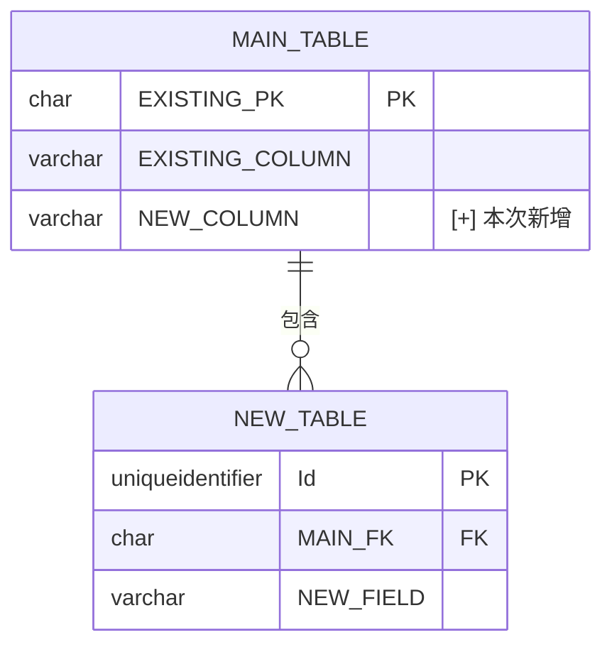

# {功能名稱} 功能調整後端規格書

<!--
  文件定位：
  - 本文件為「功能調整後端規格書」，只記錄後端 API 的異動部分
  - 前置文件：功能調整需求文件（CR-FRD）定義了 What 和 Why
  - 本文件定義：後端如何實作需求變更（只寫異動，不重複原始 BFS）
  - 搭配文件：功能調整前端規格書（CR-FFS），同次調整模式產出

  核心原則：
  1. 只寫「新增、修改、移除」的 API 端點、欄位、驗證規則
  2. 明確標記每個項目的類型：[+] 新增 / [~] 修改 / [-] 移除
  3. 標示 Breaking Change（向後不相容的變更）
  4. 不重複原始 BFS 中未變更的內容

  命名規範：
  - 文件編號：CR-BFS-{模組代號}-{序號}
  - 原始文件編號：對應的 BFS-{模組代號}-{序號}
  - 文件路徑：docs/{模組名稱}/{功能名稱}/{功能名稱}_功能調整後端規格書_{ticket}.md
    例：docs/採購模組/採購收料/採購收料_功能調整後端規格書_MP-693.md

  圖示說明：
  - [+] 新增：本次新增的項目
  - [~] 修改：本次修改的項目（需顯示原值 → 新值）
  - [-] 移除：本次移除或停用的項目
  - ⚠️ Breaking Change：此變更不向後相容，前端需同步更新
-->

---

## 文件資訊

| 項目 | 內容 |
|------|------|
| 文件編號 | CR-BFS-{模組代號}-{序號} |
| 版本 | 1.0 |
| 狀態 | 草稿 / 審查中 / 已核准 |
| 建立日期 | YYYY-MM-DD |
| 最後更新 | YYYY-MM-DD |
| 撰寫者 | {姓名} |
| 審核者 | {姓名} |
| Linear Ticket | {MP-XXX} |

### 修訂歷史

| 版本 | 日期 | 修訂者 | 變更說明 |
|------|------|--------|----------|
| 1.0 | YYYY-MM-DD | {姓名} | 初版建立 |

### 開發狀態追蹤

| 項目 | 狀態 | 說明 |
|------|------|------|
| 開發狀態 | 🔴 未開始 / 🟡 開發中 / 🟢 已完成 | |
| 測試狀態 | 🔴 未測試 / 🟡 測試中 / 🟢 已通過 (X/Y) | |
| 程式碼審查 | 🔴 未審查 / 🟡 審查中 / 🟢 已通過 | |

---

## 參照文件

| 項目 | 內容 |
|------|------|
| 原始後端規格書 | `docs/{模組名稱}/{功能名稱}/{功能名稱}後端功能規格書.md`（BFS-{模組代號}-{序號}，版本 {N.M}） |
| 原始前端規格書 | `docs/{模組名稱}/{功能名稱}/{功能名稱}前端功能規格書.md`（FFS-{模組代號}-{序號}，版本 {N.M}） |
| 功能調整需求文件 | `docs/{模組名稱}/{功能名稱}/{功能名稱}_功能調整需求文件_{ticket}.md`（CR-FRD-{模組代號}-{序號}） |
| 功能調整前端規格書 | `docs/{模組名稱}/{功能名稱}/{功能名稱}_功能調整前端規格書_{ticket}.md`（CR-FFS-{模組代號}-{序號}） |

> **重要**：本文件僅記錄「異動部分」。未列出的原始 BFS 端點、欄位、驗證規則維持不變。

---

## 1. 變更摘要

### 1.1 變更說明

{一段話說明本次後端變更的整體目的}

### 1.2 異動清單

| 類型 | 項目 | 說明 |
|------|------|------|
| [+] 新增 API | `POST /api/v3/{Area}/{Entity}/{sub}` | {說明} |
| [~] 修改 API | `GET /api/v3/{Area}/{Entity}` Response | {說明，e.g. 新增回傳欄位} |
| [-] 移除 API | `DELETE /api/v3/{Area}/{Entity}/{id}` | {說明，e.g. 改由軟刪除取代} |
| [+] 新增欄位 | `{EntityName}.{FieldName}` | {說明} |
| [~] 修改驗證規則 | VR-00X | {說明} |

### 1.3 Breaking Change 評估

| 異動項目 | 是否 Breaking Change | 影響範圍 | 緩解措施 |
|---------|---------------------|----------|----------|
| {項目} | ⚠️ 是 / ✅ 否 | {受影響的前端/系統} | {如版本共存、廢棄標記等} |

---

## 2. 影響分析

### 2.1 受影響的原始端點

| 原始端點 | 影響類型 | 變更說明 |
|---------|---------|----------|
| `GET /api/v3/{Area}/{Entity}` | 無影響 / Response 新增欄位 / 廢棄 | {說明} |
| `POST /api/v3/{Area}/{Entity}` | 無影響 / Request 新增必填欄位 ⚠️ | {說明} |

### 2.2 向後相容性

- **新增端點**：✅ 向後相容（前端可選擇性使用）
- **修改 Response**：✅ 向後相容（新增欄位，原欄位不變）
- **修改 Request 必填欄位**：⚠️ **Breaking Change**（前端必須同步調整）
- **移除端點**：⚠️ **Breaking Change**（前端必須改用新端點）

---

## 3. 資料模型變更

<!--
只寫有變更的 Entity / Table。未變更的資料模型請參照原始 BFS。
-->

### 3.1 資料庫變更

| 類型 | 資料表 | 欄位 | 變更說明 |
|------|--------|------|----------|
| [+] 新增欄位 | `{Schema}.{Table}` | `{COLUMN_NAME}` {TYPE}({LEN}) NOT NULL | {說明} |
| [~] 修改欄位 | `{Schema}.{Table}` | `{COLUMN_NAME}` {原型態} → {新型態} | {說明} |
| [+] 新增資料表 | `{Schema}.{NewTable}` | - | {說明} |

> **Migration 提示**：若有新增欄位，需執行 `dotnet ef migrations add {MigrationName}`

### 3.2 ER Diagram 差異

<!--
只畫「有異動」的 Entity 或新增的關聯線。
-->



### 3.3 欄位對應異動

| 類型 | DB 欄位 | Entity 屬性 | Request 屬性 | Response 屬性 | 說明 |
|------|---------|-------------|-------------|---------------|------|
| [+] | `NEW_COLUMN` | `NewProperty` | `NewProperty` | `newProperty` | {說明} |
| [~] | `EXISTING_COL` | `ExistingProp` | `ExistingProp`（原可選 → 必填 ⚠️） | `existingProp` | {說明} |
| [-] | `OLD_COLUMN` | `OldProperty` | - | - | 已廢棄，不再回傳 |

---

## 4. API 異動規格

<!--
每個異動端點都需要完整規格（同原始 BFS 的格式）。
未異動的端點請參照原始 BFS。
-->

### 4.1 新增端點

#### [+] {HTTP Method} /api/v3/{Area}/{Entity}/{sub-route}

**說明：** {端點用途}

**Request：** `{RequestModel}`

| 屬性名稱 | 型態 | 必填 | 長度限制 | 說明 | 驗證規則 |
|----------|------|------|----------|------|----------|
| {PropertyName} | string | O | 50 | {說明} | CVR-001 |
| {PropertyName} | Guid | O | - | {說明} | CVR-002 |

```json
{
  "{propertyName}": "{value}",
  "{anotherId}": "00000000-0000-0000-0000-000000000000"
}
```

**Response：** `{ResponseModel}`

```json
{
  "id": "00000000-0000-0000-0000-000000000000",
  "{field}": "{value}"
}
```

**錯誤回應：**

| HTTP 狀態碼 | 情境 | 說明 |
|------------|------|------|
| 400 | 驗證失敗 | 欄位驗證錯誤 |
| 404 | 資料不存在 | {Entity} 不存在 |

---

### 4.2 修改端點

#### [~] {HTTP Method} /api/v3/{Area}/{Entity}/{id}

**說明：** {說明原端點，以及本次變更內容}

**Request 變更（`{RequestModel}`）：**

| 屬性名稱 | 類型 | 變更 | 說明 |
|----------|------|------|------|
| `{NewProperty}` | string | [+] 新增，必填 | {說明} |
| `{ModifiedProperty}` | string? → string | [~] 可選 → 必填 ⚠️ | {說明} |

**完整 Request（含原有欄位）：**

```json
{
  "{existingField}": "{value}",
  "{newField}": "{value}"
}
```

**Response 變更（`{ResponseModel}`）：**

| 屬性名稱 | 類型 | 變更 | 說明 |
|----------|------|------|------|
| `{newResponseField}` | string | [+] 新增 | {說明} |

**完整 Response（含原有欄位）：**

```json
{
  "id": "00000000-0000-0000-0000-000000000000",
  "{existingField}": "{value}",
  "{newField}": "{value}"
}
```

---

### 4.3 移除端點

#### [-] {HTTP Method} /api/v3/{Area}/{Entity}/{old-route}

**說明：** 本端點已移除。

**替代方案：** 請改用 `{HTTP Method} /api/v3/{Area}/{Entity}/{new-route}`

---

## 5. 驗證規則異動

<!--
只寫新增或修改的 VR/BR。未異動的驗證規則請參照原始 BFS。
-->

### 5.1 輸入驗證（FluentValidation）

| 規則編號 | 類型 | 欄位 | 驗證類型 | 規則描述 | 錯誤訊息 |
|----------|------|------|----------|----------|----------|
| CVR-001 | [+] 新增 | {欄位} | 必填 | 不可為空 | `{欄位名稱} 為必填欄位` |
| CVR-002 | [~] 修改 | {欄位} | 長度 | {原N} → {新N} | `{欄位名稱} 長度不可超過 {新N} 字元` |

### 5.2 業務驗證（Handler 層）

| 規則編號 | 類型 | 規則名稱 | 規則描述 | 驗證時機 | 錯誤訊息 |
|----------|------|----------|----------|----------|----------|
| CBR-001 | [+] 新增 | {規則名稱} | {規則描述} | 新增/修改 | `{錯誤訊息}` |

---

## 6. CQRS 實作異動

### 6.1 新增 Handler

| Handler | 類型 | 路徑 |
|---------|------|------|
| `Create{SubFeature}Handler` | Command | `Application/{Module}/{Entity}Service/Commands/Create{SubFeature}/` |
| `Get{SubFeature}Handler` | Query | `Application/{Module}/{Entity}Service/Queries/Get{SubFeature}/` |

### 6.2 修改 Handler

| Handler | 路徑 | 修改說明 |
|---------|------|----------|
| `{Existing}Handler` | `Application/...` | {說明變更的業務邏輯} |

### 6.3 新增 Repository 方法

| 方法 | 介面 | 說明 |
|------|------|------|
| `{MethodName}Async` | `I{Entity}Repository` | {說明} |

---

## 7. 測試案例補充

### 7.1 新增端點測試

| 編號 | 測試類別 | 測試案例 | 情境 | 預期結果 |
|------|---------|---------|------|----------|
| CUT-001 | `{NewHandler}Tests` | `WithValidData_ShouldSucceed` | 有效資料 | 成功 |
| CUT-002 | `{NewHandler}Tests` | `{Scenario}_Should{Result}` | {情境} | {結果} |

### 7.2 修改端點迴歸測試

| 編號 | 測試案例 | 測試目的 |
|------|---------|----------|
| CRT-001 | `{Existing}HandlerTests.ExistingBehavior_ShouldStillWork` | 確認原有行為不受影響 |

---

## 8. 驗收標準

### 8.1 功能驗收

| 編號 | 驗收項目 | 驗收條件 | 通過 |
|------|----------|----------|------|
| CFA-01 | 新增端點 | 新端點可正常回應，格式符合規格 | [ ] |
| CFA-02 | 修改端點 | 修改後端點新舊欄位均正確回傳 | [ ] |

### 8.2 向後相容性驗收

| 編號 | 驗收項目 | 驗收條件 | 通過 |
|------|----------|----------|------|
| CBC-01 | 原有端點 | 未異動的端點 Response 格式一致 | [ ] |
| CBC-02 | 建置成功 | `dotnet build` 無錯誤 | [ ] |
| CBC-03 | 測試通過 | `dotnet test` 全部通過 | [ ] |

---

## 附錄

### A. 相關文件

| 文件 | 說明 |
|------|------|
| [原始後端功能規格書](../../{模組名稱}/{功能名稱}/{功能名稱}後端功能規格書.md) | 完整原始規格 |
| [功能調整前端規格書](./{功能名稱}_功能調整前端規格書_{ticket}.md) | 對應前端規格 |
| [功能調整需求文件](./{功能名稱}_功能調整需求文件_{ticket}.md) | 業務需求 |
