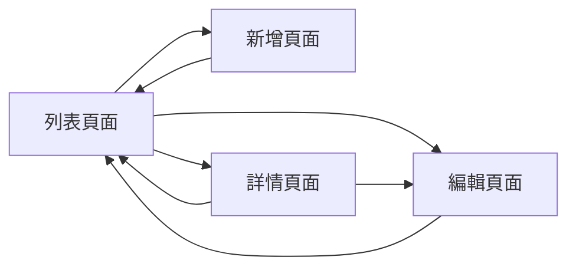
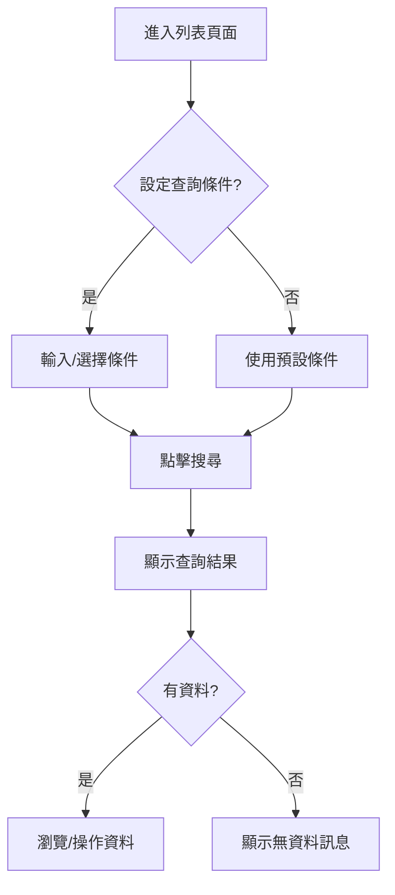
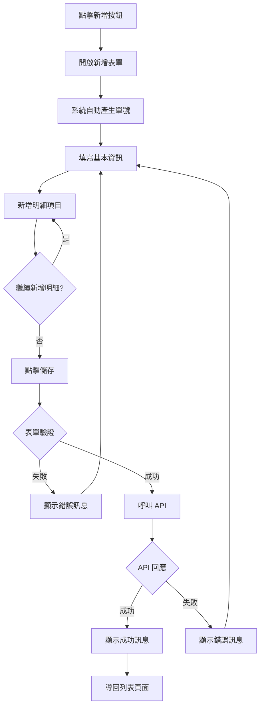
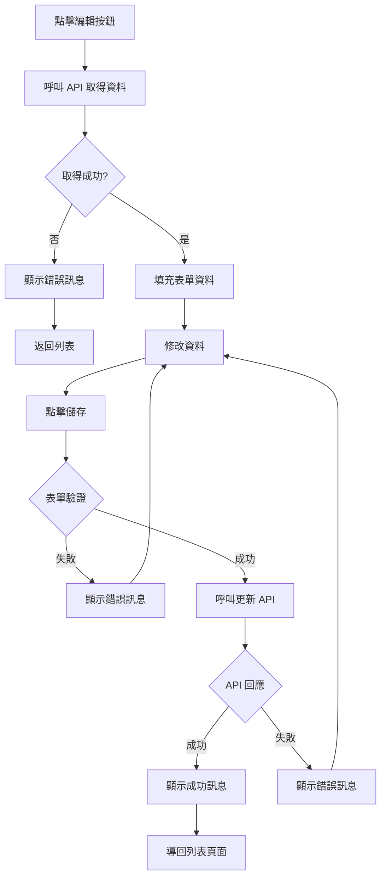
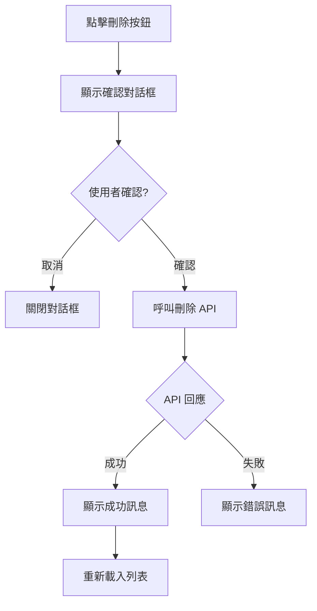
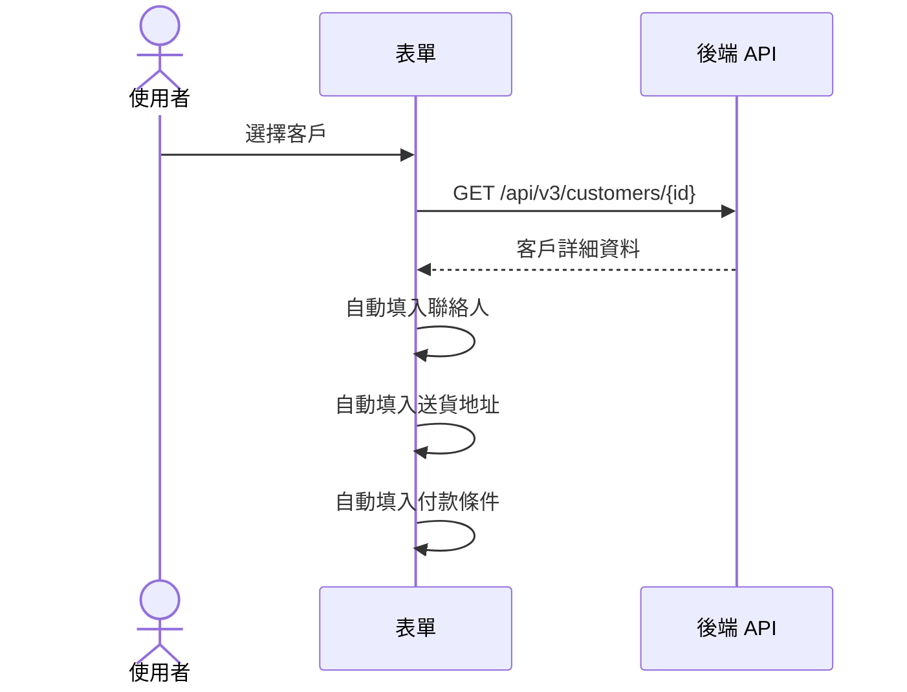
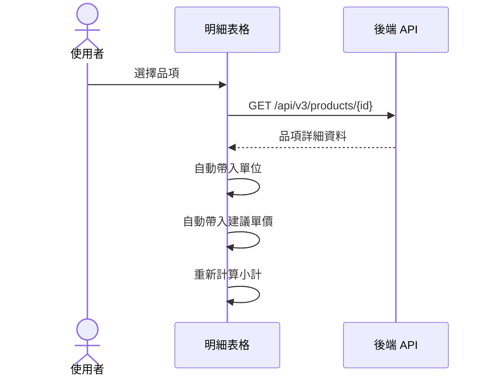

# {功能名稱} 前端功能規格書

<!--
  使用說明：
  1. 將 {佔位符} 替換為實際內容
  2. 根據功能類型刪除不適用的章節
  3. 此範本依據 ISO/IEC 25010:2023 軟體品質模型及前端設計最佳實踐
  4. 需搭配功能需求文件範本與後端功能規格書範本使用
-->

---

## 版本資訊

| 版本 | 日期 | 作者 | 說明 |
| --- | --- | --- | --- |
| 1.0 | YYYY-MM-DD | {作者} | 初始版本 |

---

## 1. 文件概述

### 1.1 目的

本文件定義 **{功能名稱}** 功能的前端規格，作為前端開發與測試的依據。

### 1.2 適用範圍

- **目標使用者**：{使用者角色，如：業務人員、倉管人員}
- **使用情境**：{簡述使用情境}
- **涵蓋範圍**：{列出涵蓋的功能項目}

### 1.3 相關文件

| 文件名稱 | 說明 |
| --- | --- |
| {功能名稱} 功能需求文件 | 業務需求與使用者故事 |
| {功能名稱} 後端功能規格書 | API 規格與資料處理邏輯 |
| {相關功能} 前端功能規格書 | 關聯功能的 UI 規格 |

### 1.4 術語定義

| 術語 | 定義 |
| --- | --- |
| {術語1} | {定義} |
| {術語2} | {定義} |

---

## 2. 使用者介面設計

### 2.1 頁面總覽



### 2.2 頁面佈局

#### 2.2.1 列表頁面 ({功能名稱}List)

```
┌──────────────────────────────────────────────────────────┐
│ 頁面標題                                    [新增] [匯出] │
├──────────────────────────────────────────────────────────┤
│ 搜尋條件區                                               │
│ ┌────────────┐ ┌────────────┐ ┌────────────┐ [搜尋]    │
│ │ 起始日期   │ │ 結束日期   │ │ 關鍵字     │ [清除]    │
│ └────────────┘ └────────────┘ └────────────┘            │
├──────────────────────────────────────────────────────────┤
│ 資料表格區                                               │
│ ┌─────┬─────────┬─────────┬─────────┬───────┬────────┐ │
│ │ □   │ 單號    │ 日期    │ 客戶    │ 金額  │ 操作   │ │
│ ├─────┼─────────┼─────────┼─────────┼───────┼────────┤ │
│ │ □   │ SO-001  │ 2024/01 │ A客戶   │ 1,000 │ ⋮      │ │
│ │ □   │ SO-002  │ 2024/01 │ B客戶   │ 2,000 │ ⋮      │ │
│ └─────┴─────────┴─────────┴─────────┴───────┴────────┘ │
├──────────────────────────────────────────────────────────┤
│ ◀ 1 2 3 ... ▶                     共 100 筆 每頁 20 筆  │
└──────────────────────────────────────────────────────────┘
```

**元件規格**：

| 區塊 | 元件 | 說明 |
| --- | --- | --- |
| 頁面標題 | Typography | 顯示 "{功能名稱}" |
| 新增按鈕 | Button (primary) | 導向新增頁面 |
| 搜尋條件 | Form | 包含日期範圍、下拉選單、關鍵字輸入 |
| 資料表格 | Table | 支援排序、分頁、多選 |
| 分頁控制 | Pagination | 顯示總筆數、切換頁數 |

#### 2.2.2 新增/編輯頁面 ({功能名稱}Form)

```
┌──────────────────────────────────────────────────────────┐
│ {功能名稱} - 新增                            [儲存] [取消] │
├──────────────────────────────────────────────────────────┤
│ 基本資訊                                                 │
│ ┌─────────────────────┐  ┌─────────────────────┐       │
│ │ 單號 *              │  │ 日期 *              │       │
│ │ [自動產生]          │  │ [📅 2024/01/15]     │       │
│ └─────────────────────┘  └─────────────────────┘       │
│ ┌─────────────────────┐  ┌─────────────────────┐       │
│ │ 客戶 *              │  │ 業務人員            │       │
│ │ [🔍 選擇客戶]       │  │ [▼ 選擇人員]        │       │
│ └─────────────────────┘  └─────────────────────┘       │
├──────────────────────────────────────────────────────────┤
│ 明細項目                                        [新增明細] │
│ ┌─────┬──────────┬─────────┬──────────┬────────────────┐ │
│ │ #   │ 品項     │ 數量    │ 單價     │ 小計   │ 操作  │ │
│ ├─────┼──────────┼─────────┼──────────┼────────────────┤ │
│ │ 1   │ [🔍選擇] │ [輸入]  │ [輸入]   │ 自動計算│ 🗑️  │ │
│ └─────┴──────────┴─────────┴──────────┴────────────────┘ │
├──────────────────────────────────────────────────────────┤
│                                    合計金額：$ 10,000    │
└──────────────────────────────────────────────────────────┘
```

**元件規格**：

| 區塊 | 元件 | 說明 |
| --- | --- | --- |
| 單號 | Input (disabled) | 自動產生，格式：{格式說明} |
| 日期 | DatePicker | 預設今日，必填 |
| 客戶 | SearchSelect | 開窗選擇，必填 |
| 明細表格 | EditableTable | 支援新增、刪除、即時計算 |
| 儲存按鈕 | Button (primary) | 執行表單驗證後送出 |

---

## 3. 使用者操作流程

### 3.1 查詢流程



### 3.2 新增流程



### 3.3 編輯流程



### 3.4 刪除流程



---

## 4. 欄位驗證規則

### 4.1 主檔欄位驗證

| 欄位名稱 | 欄位代碼 | 必填 | 驗證規則 | 錯誤訊息 |
| --- | --- | --- | --- | --- |
| 單號 | `{entityNo}` | ✅ | 系統自動產生 | - |
| 日期 | `{dateField}` | ✅ | 有效日期 | 請選擇有效日期 |
| 客戶 | `customerId` | ✅ | 必須選擇 | 請選擇客戶 |
| 業務人員 | `employeeId` | ❌ | Guid 格式 | 人員資料格式錯誤 |
| 備註 | `remark` | ❌ | 最大 500 字元 | 備註不可超過 500 字元 |

### 4.2 明細欄位驗證

| 欄位名稱 | 欄位代碼 | 必填 | 驗證規則 | 錯誤訊息 |
| --- | --- | --- | --- | --- |
| 品項 | `productId` | ✅ | 必須選擇 | 請選擇品項 |
| 數量 | `quantity` | ✅ | 大於 0 的整數 | 數量必須大於 0 |
| 單價 | `unitPrice` | ✅ | 大於等於 0 | 單價不可為負數 |
| 小計 | `amount` | - | 自動計算 (數量 × 單價) | - |

### 4.3 表單層級驗證

| 驗證項目 | 驗證規則 | 錯誤訊息 |
| --- | --- | --- |
| 明細筆數 | 至少一筆明細 | 請至少新增一筆明細 |
| 重複品項 | 不允許重複品項 | 品項 {品項名稱} 已存在，請修改數量 |
| 金額上限 | 總金額不超過 {上限} | 訂單金額超過上限 |

### 4.4 驗證時機

| 時機 | 說明 |
| --- | --- |
| 欄位離焦 (onBlur) | 單一欄位即時驗證 |
| 欄位變更 (onChange) | 清除該欄位錯誤訊息 |
| 表單送出 (onSubmit) | 完整表單驗證 |
| 明細新增 | 驗證新增的明細列 |

---

## 5. 使用者操作業務邏輯

### 5.1 選擇器連動邏輯

#### 5.1.1 客戶選擇連動



**連動欄位**：

| 觸發欄位 | 連動欄位 | 連動規則 |
| --- | --- | --- |
| 客戶 | 聯絡人 | 自動帶入客戶預設聯絡人 |
| 客戶 | 送貨地址 | 自動帶入客戶預設地址 |
| 客戶 | 付款條件 | 自動帶入客戶預設付款條件 |

#### 5.1.2 品項選擇連動



### 5.2 即時計算邏輯

#### 5.2.1 明細小計計算

```
小計 = 數量 × 單價
```

**觸發時機**：數量或單價變更時

#### 5.2.2 合計金額計算

```
合計金額 = Σ(各明細小計)
稅額 = 合計金額 × 稅率
總金額 = 合計金額 + 稅額
```

**顯示格式**：千分位，保留小數點後 2 位

### 5.3 狀態控制邏輯

#### 5.3.1 欄位啟用/停用

| 條件 | 欄位狀態 |
| --- | --- |
| 新增模式 | 單號停用，其他啟用 |
| 編輯模式 | 單號停用，日期可改 |
| 已審核 | 全部欄位停用 |
| 已結案 | 全部欄位停用 |

#### 5.3.2 按鈕顯示控制

| 狀態 | 編輯按鈕 | 刪除按鈕 | 審核按鈕 |
| --- | --- | --- | --- |
| 草稿 | ✅ 顯示 | ✅ 顯示 | ✅ 顯示 |
| 已審核 | ❌ 隱藏 | ❌ 隱藏 | ❌ 隱藏 |
| 已結案 | ❌ 隱藏 | ❌ 隱藏 | ❌ 隱藏 |

---

## 6. API 對接規格

### 6.1 API 端點對應

| 操作 | HTTP 方法 | API 端點 | 說明 |
| --- | --- | --- | --- |
| 查詢列表 | GET | `/api/v3/{area}/{entity}` | 取得全部資料 |
| 分頁查詢 | GET | `/api/v3/{area}/{entity}/paged` | 支援搜尋、排序、分頁 |
| 取得單筆 | GET | `/api/v3/{area}/{entity}/{id}` | 取得詳細資料含明細 |
| 新增 | POST | `/api/v3/{area}/{entity}` | 新增含明細 |
| 修改 | PUT | `/api/v3/{area}/{entity}/{id}` | 更新含明細 |
| 刪除 | DELETE | `/api/v3/{area}/{entity}/{id}` | 刪除主檔及明細 |
| 選擇器 | GET | `/api/v3/{area}/{entity}/light` | 下拉選單資料 |

### 6.2 Request 格式

#### 新增/修改 Request

```json
{
  "{dateField}": "2024-01-15",
  "customerId": "guid",
  "employeeId": "guid",
  "remark": "備註說明",
  "items": [
    {
      "productId": "guid",
      "quantity": 10,
      "unitPrice": 100
    }
  ]
}
```

#### 分頁查詢 Request

```
GET /api/v3/{area}/{entity}/paged?
  dateFrom=2024-01-01&
  dateTo=2024-01-31&
  customerId=guid&
  keywords=關鍵字&
  pageNumber=1&
  pageSize=20&
  sortBy=date&
  sortDirection=desc
```

### 6.3 Response 格式

#### 成功回應

```json
{
  "id": "guid",
  "{entityNo}": "SO-20240115-001",
  "{dateField}": "2024-01-15",
  "customer": {
    "customerId": "guid",
    "customerName": "客戶名稱"
  },
  "items": [
    {
      "itemId": "guid",
      "product": {
        "productId": "guid",
        "productName": "品項名稱"
      },
      "quantity": 10,
      "unitPrice": 100,
      "amount": 1000
    }
  ],
  "totalAmount": 1000
}
```

#### 錯誤回應處理

| HTTP 狀態碼 | 處理方式 |
| --- | --- |
| 400 | 顯示欄位驗證錯誤訊息 |
| 401 | 導向登入頁面 |
| 403 | 顯示權限不足訊息 |
| 404 | 顯示資料不存在訊息 |
| 409 | 顯示資料衝突訊息 (如：已被他人修改) |
| 500 | 顯示系統錯誤訊息 |

---

## 7. 畫面與舊系統對應

### 7.1 欄位對應表

| 畫面標籤 | 舊系統欄位 | API 欄位 | 型態 | 備註 |
| --- | --- | --- | --- | --- |
| {標籤1} | {COLUMN1} | `{apiField1}` | {Type} | {備註} |
| {標籤2} | {COLUMN2} | `{apiField2}` | {Type}? | {備註} |
| {標籤3} | {COLUMN3} | 系統自動產生 | 自動 | 格式: {格式說明} |

### 7.2 狀態碼對應

| 舊系統代碼 | 新系統狀態 | 說明 |
| --- | --- | --- |
| {code1} | `{status1}` | {說明1} |
| {code2} | `{status2}` | {說明2} |

---

## 8. 驗收標準

### 8.1 查詢功能驗收

| 編號 | 驗收項目 | 預期結果 | 優先級 |
| --- | --- | --- | --- |
| TC-Q-001 | 列表頁面載入 | 顯示預設查詢結果，分頁正確 | 高 |
| TC-Q-002 | 日期範圍查詢 | 僅顯示範圍內資料 | 高 |
| TC-Q-003 | 關鍵字搜尋 | 支援 {搜尋欄位} 模糊比對 | 中 |
| TC-Q-004 | 排序功能 | 點擊欄位標題正確排序 | 中 |
| TC-Q-005 | 無資料處理 | 顯示「查無資料」訊息 | 中 |

### 8.2 新增功能驗收

| 編號 | 驗收項目 | 預期結果 | 優先級 |
| --- | --- | --- | --- |
| TC-C-001 | 表單開啟 | 自動產生單號，日期預設今日 | 高 |
| TC-C-002 | 必填欄位驗證 | 未填必填欄位顯示錯誤訊息 | 高 |
| TC-C-003 | 欄位格式驗證 | 輸入不符格式顯示錯誤訊息 | 高 |
| TC-C-004 | 選擇器連動 | 選擇客戶後自動帶入相關欄位 | 高 |
| TC-C-005 | 明細新增 | 可新增多筆明細，自動計算小計 | 高 |
| TC-C-006 | 儲存成功 | 顯示成功訊息，導回列表 | 高 |

### 8.3 編輯功能驗收

| 編號 | 驗收項目 | 預期結果 | 優先級 |
| --- | --- | --- | --- |
| TC-U-001 | 資料載入 | 正確顯示現有資料 | 高 |
| TC-U-002 | 欄位修改 | 可修改允許的欄位 | 高 |
| TC-U-003 | 明細增刪改 | 可增刪改明細，正確重新計算 | 高 |
| TC-U-004 | 更新成功 | 顯示成功訊息，導回列表 | 高 |

### 8.4 刪除功能驗收

| 編號 | 驗收項目 | 預期結果 | 優先級 |
| --- | --- | --- | --- |
| TC-D-001 | 刪除確認 | 顯示確認對話框 | 高 |
| TC-D-002 | 取消刪除 | 關閉對話框，資料保留 | 中 |
| TC-D-003 | 確認刪除 | 刪除成功，列表更新 | 高 |

### 8.5 例外處理驗收

| 編號 | 驗收項目 | 預期結果 | 優先級 |
| --- | --- | --- | --- |
| TC-E-001 | 網路中斷 | 顯示網路錯誤提示 | 高 |
| TC-E-002 | 資料被他人刪除 | 顯示資料不存在訊息 | 中 |
| TC-E-003 | 權限不足 | 顯示權限不足訊息 | 高 |
| TC-E-004 | 伺服器錯誤 | 顯示系統錯誤訊息 | 高 |

---

## 附錄

### A. 元件規格說明

| 元件類型 | 說明 | 適用場景 |
| --- | --- | --- |
| Input | 文字輸入框 | 一般文字輸入 |
| DatePicker | 日期選擇器 | 日期欄位 |
| Select | 下拉選單 | 固定選項 |
| SearchSelect | 搜尋式選擇器 | 資料筆數多的選擇 |
| EditableTable | 可編輯表格 | 明細資料 |
| Button | 按鈕 | 操作觸發 |
| Pagination | 分頁元件 | 列表分頁 |

### B. 錯誤訊息格式

```json
{
  "type": "https://tools.ietf.org/html/rfc7231#section-6.5.1",
  "title": "Bad Request",
  "status": 400,
  "errors": {
    "CustomerId": ["請選擇客戶"],
    "Items": ["請至少新增一筆明細"]
  }
}
```

### C. 鍵盤操作支援

| 快捷鍵 | 功能 |
| --- | --- |
| Enter | 表格內移至下一欄 |
| Tab | 移至下一個輸入欄位 |
| Esc | 取消編輯/關閉對話框 |
| Ctrl+S | 儲存 (如支援) |

### D. 圖示說明

| 圖示 | 說明 |
| --- | --- |
| ✅ | 已實作/必填 |
| ❌ | 未實作/非必填/停用 |
| ⚠️ | 需特別注意 |
| 🔍 | 開窗搜尋 |
| 📅 | 日期選擇 |
| 🗑️ | 刪除 |
