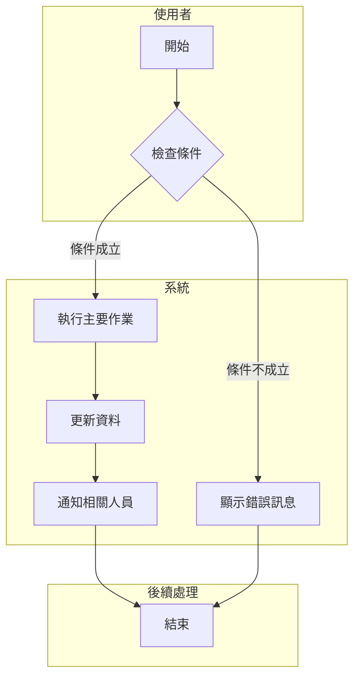
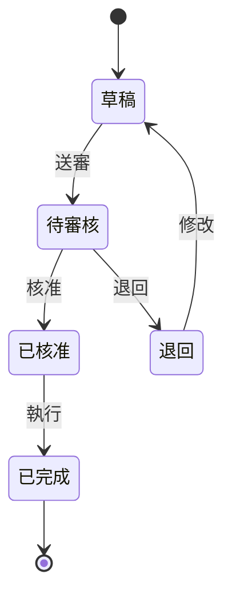

# {功能名稱} 功能需求文件

<!--
  文件用途：定義功能需求的「What」和「Why」，不涉及「How」
  適用階段：需求分析、客戶溝通、開發前確認
  後續文件：系統分析文件 (SAD) 分析「How to Realize」

  核心原則：
  1. 以 PM 視角清楚表達業務價值和使用者需求
  2. 多角度呈現（文字 + 業務流程圖 + UI 原型）
  3. 明確的驗收標準
  4. 可追溯、可測試
  5. 不涉及系統互動、系統整合等技術分析（由 SAD 負責）

  參考標準：
  - IEEE 830-1998 Software Requirements Specification
  - ISO/IEC/IEEE 29148:2018 Requirements Engineering
-->

---

## 文件資訊

| 項目 | 內容 |
|------|------|
| 文件編號 | FRD-{模組代號}-{序號} |
| 版本 | 1.0 |
| 狀態 | 草稿 / 審查中 / 已核准 |
| 建立日期 | YYYY-MM-DD |
| 最後更新 | YYYY-MM-DD |
| 撰寫者 | {姓名} |
| 審核者 | {姓名} |

### 修訂歷史

| 版本 | 日期 | 修訂者 | 變更說明 |
|------|------|--------|----------|
| 1.0 | YYYY-MM-DD | {姓名} | 初版建立 |

---

## 1. 需求概述

### 1.1 業務背景

<!--
說明：用 2-3 段話描述這個需求的業務背景
- 目前的業務痛點是什麼？
- 為什麼需要這個功能？
- 不做會有什麼影響？
-->

{描述目前的業務現況、遇到的問題或痛點，以及為什麼需要這個功能}

### 1.2 功能目標

<!-- 說明：列出 3-5 個具體、可衡量的目標 -->

| 編號 | 目標 | 成功指標 |
|------|------|----------|
| G-01 | {目標描述} | {如何判斷目標達成} |
| G-02 | {目標描述} | {如何判斷目標達成} |
| G-03 | {目標描述} | {如何判斷目標達成} |

### 1.3 功能範圍

**包含（In Scope）：**
- {功能項目 1}
- {功能項目 2}
- {功能項目 3}

**不包含（Out of Scope）：**
- {排除項目 1}
- {排除項目 2}

### 1.4 利害關係人

| 角色 | 代表人 | 關注重點 | 參與程度 |
|------|--------|----------|----------|
| 業務需求方 | {姓名/部門} | {主要關注的面向} | 高/中/低 |
| 最終使用者 | {角色描述} | {使用時的關注點} | 高/中/低 |
| 系統維護者 | {姓名/部門} | {技術或維運考量} | 高/中/低 |

---

## 2. 使用者故事

<!--
使用者故事格式：
As a <角色>, I want to <功能>, so that <效益>

每個故事必須包含驗收條件（Acceptance Criteria）
-->

### 2.1 故事清單

| 編號 | 使用者故事 | 優先級 |
|------|-----------|--------|
| US-01 | 身為 {角色}，我想要 {功能描述}，以便 {業務價值} | Must |
| US-02 | 身為 {角色}，我想要 {功能描述}，以便 {業務價值} | Should |
| US-03 | 身為 {角色}，我想要 {功能描述}，以便 {業務價值} | Could |

**優先級說明：**
- **Must**：核心功能，必須實作
- **Should**：重要功能，應該實作
- **Could**：加值功能，可以實作
- **Won't**：本次不做

### 2.2 故事詳述

#### US-01：{故事標題}

**故事描述：**
> 身為 {角色}，我想要 {功能描述}，以便 {業務價值}

**情境說明：**
{描述使用者會在什麼情況下使用這個功能，解決什麼問題}

**驗收條件（Given-When-Then）：**

| 條件 | 描述 |
|------|------|
| **Given**（前置條件） | {系統或資料的初始狀態} |
| **When**（執行動作） | {使用者執行的操作} |
| **Then**（預期結果） | {系統應該呈現的結果} |

**例外情境：**

| 情境 | 處理方式 |
|------|----------|
| {例外情況 1} | {系統如何回應} |
| {例外情況 2} | {系統如何回應} |

---

## 3. 業務流程

### 3.1 主流程圖

<!--
說明：使用 Mermaid 語法繪製「業務層面」的流程圖
- 呈現使用者的操作步驟與決策點
- 聚焦「人做什麼」而非「系統做什麼」
- 系統互動、資料流向等技術分析由系統分析文件 (SAD) 負責
-->



### 3.2 狀態流程圖

<!--
說明：如果功能涉及狀態變化，使用狀態圖呈現
-->



### 3.3 作業流程說明

| 步驟 | 執行者 | 作業內容 | 輸入 | 輸出 | 備註 |
|------|--------|----------|------|------|------|
| 1 | {角色} | {作業描述} | {需要的資料} | {產出的結果} | {補充說明} |
| 2 | 系統 | {作業描述} | {需要的資料} | {產出的結果} | {補充說明} |
| 3 | {角色} | {作業描述} | {需要的資料} | {產出的結果} | {補充說明} |

---

## 4. 畫面設計

### 4.1 畫面總覽

<!--
說明：列出本功能涉及的所有畫面
-->

| 畫面編號 | 畫面名稱 | 用途說明 | 進入方式 |
|----------|----------|----------|----------|
| SCR-01 | {畫面名稱} | {用途} | {從哪裡進入} |
| SCR-02 | {畫面名稱} | {用途} | {從哪裡進入} |

### 4.2 畫面詳細規格

#### SCR-01：{畫面名稱}

**畫面路徑：** {主選單} > {子選單} > {功能名稱}

**畫面示意圖：**

```
┌─────────────────────────────────────────────────────────────────┐
│ {功能名稱}                                          [X] 關閉    │
├─────────────────────────────────────────────────────────────────┤
│                                                                 │
│  ┌─ 查詢條件 ─────────────────────────────────────────────────┐ │
│  │                                                             │ │
│  │  {欄位1}：[___________]    {欄位2}：[▼ 下拉選單 ▼]         │ │
│  │                                                             │ │
│  │  {日期起}：[____/____/____] ~ {日期迄}：[____/____/____]    │ │
│  │                                                             │ │
│  │                              [清除] [查詢]                  │ │
│  └─────────────────────────────────────────────────────────────┘ │
│                                                                 │
│  ┌─ 查詢結果 ─────────────────────────────────────────────────┐ │
│  │ [新增] [匯出]                                               │ │
│  │ ┌──────┬──────────┬──────────┬──────────┬────────┐         │ │
│  │ │ 操作 │ {欄位A}   │ {欄位B}   │ {欄位C}   │ {欄位D} │         │ │
│  │ ├──────┼──────────┼──────────┼──────────┼────────┤         │ │
│  │ │[編輯]│ {資料}    │ {資料}    │ {資料}    │ {資料}  │         │ │
│  │ │[刪除]│          │          │          │        │         │ │
│  │ └──────┴──────────┴──────────┴──────────┴────────┘         │ │
│  │                                                             │ │
│  │ 共 XX 筆，第 1/N 頁    [<] [1] [2] [3] [>]    每頁 20 筆 ▼  │ │
│  └─────────────────────────────────────────────────────────────┘ │
│                                                                 │
└─────────────────────────────────────────────────────────────────┘
```

**查詢條件欄位：**

| 欄位名稱 | 元件類型 | 必填 | 預設值 | 說明 |
|----------|----------|------|--------|------|
| {欄位1} | 文字輸入 | 否 | 空白 | 模糊查詢，支援部分比對 |
| {欄位2} | 下拉選單 | 否 | 全部 | 選項來源：{資料表/固定值} |
| {日期起迄} | 日期區間 | 否 | 近 30 天 | 格式：yyyy/MM/dd |

**清單欄位：**

| 欄位名稱 | 寬度 | 對齊 | 格式 | 說明 |
|----------|------|------|------|------|
| {欄位A} | 100px | 置左 | 文字 | {說明} |
| {欄位B} | 80px | 置右 | 數字（千分位） | {說明} |
| {欄位C} | 120px | 置中 | 日期 yyyy/MM/dd | {說明} |

**操作按鈕：**

| 按鈕 | 觸發條件 | 執行動作 | 備註 |
|------|----------|----------|------|
| 查詢 | 點擊 | 依條件查詢資料並顯示於清單 | |
| 清除 | 點擊 | 還原所有查詢條件為預設值 | |
| 新增 | 點擊 | 開啟新增視窗 | 權限檢查：需有新增權限 |
| 編輯 | 點擊該列 | 開啟編輯視窗 | 權限檢查：需有編輯權限 |
| 刪除 | 點擊該列 | 顯示確認對話框後刪除 | 權限檢查：需有刪除權限 |

---

## 5. 欄位規格與驗證規則

### 5.1 資料欄位定義

<!--
說明：定義所有輸入欄位的規格
-->

| 欄位編號 | 欄位名稱 | 資料型態 | 長度 | 必填 | 預設值 | 說明 |
|----------|----------|----------|------|------|--------|------|
| F-01 | {欄位名稱} | 文字 | 50 | O | - | {說明} |
| F-02 | {欄位名稱} | 數字 | 10,2 | O | 0 | {說明} |
| F-03 | {欄位名稱} | 日期 | - | X | 系統日 | {說明} |
| F-04 | {欄位名稱} | 下拉選單 | - | O | - | 來源：{資料表} |

### 5.2 輸入驗證規則

<!--
說明：定義欄位層級的驗證規則
-->

| 規則編號 | 欄位 | 驗證類型 | 規則描述 | 錯誤訊息 |
|----------|------|----------|----------|----------|
| VR-01 | {欄位} | 必填 | 不可為空 | 「{欄位名稱}」為必填欄位 |
| VR-02 | {欄位} | 格式 | 符合 Email 格式 | 「{欄位名稱}」格式不正確 |
| VR-03 | {欄位} | 長度 | 最多 {N} 個字元 | 「{欄位名稱}」長度不可超過 {N} 個字元 |
| VR-04 | {欄位} | 範圍 | 數值須介於 {A} ~ {B} | 「{欄位名稱}」須介於 {A} ~ {B} 之間 |
| VR-05 | {欄位} | 唯一性 | 不可重複 | 「{欄位名稱}」已存在，請重新輸入 |

### 5.3 業務規則

<!--
說明：定義跨欄位或業務邏輯層級的規則
-->

| 規則編號 | 規則名稱 | 規則描述 | 觸發時機 | 處理方式 |
|----------|----------|----------|----------|----------|
| BR-01 | {規則名稱} | {詳細描述規則的判斷條件} | 新增/修改 | 阻擋並顯示訊息 |
| BR-02 | {規則名稱} | {詳細描述規則的判斷條件} | 刪除 | 阻擋並顯示訊息 |
| BR-03 | {規則名稱} | {詳細描述規則的判斷條件} | 狀態變更 | 警示但允許繼續 |

**規則詳細說明：**

#### BR-01：{規則名稱}

| 項目 | 說明 |
|------|------|
| 觸發時機 | {新增/修改/刪除/查詢/狀態變更} |
| 判斷條件 | {詳細的邏輯條件描述} |
| 處理方式 | {阻擋/警示/自動處理} |
| 錯誤訊息 | 「{顯示給使用者的訊息}」 |
| 補充說明 | {額外說明，如歷史原因、例外情況等} |

---

<!--
  §6 系統整合已移至系統分析文件 (SAD) — 由 SA 角色分析系統間互動與介面規格
-->

## 6. 非功能性需求

### 6.1 效能需求

| 項目 | 需求描述 | 目標值 |
|------|----------|--------|
| 回應時間 | 畫面查詢回應時間 | < 3 秒 |
| 並行使用者 | 同時上線人數 | 100 人 |
| 資料量 | 單次查詢最大筆數 | 10,000 筆 |

### 6.2 安全性需求

| 項目 | 需求描述 |
|------|----------|
| 權限控管 | {描述需要的權限控制機制} |
| 資料保護 | {描述敏感資料的處理方式} |
| 稽核軌跡 | {描述需要記錄的操作軌跡} |

### 6.3 可用性需求

| 項目 | 需求描述 |
|------|----------|
| 服務時段 | {例：24x7 或 營業時間} |
| 容錯機制 | {描述異常時的處理方式} |

---

## 7. 驗收標準

### 7.1 功能驗收

<!--
說明：列出可執行的測試案例作為驗收依據
-->

| 測試編號 | 測試案例 | 前置條件 | 測試步驟 | 預期結果 | 通過 |
|----------|----------|----------|----------|----------|------|
| TC-01 | {測試案例名稱} | {需要的資料或狀態} | 1. {步驟1}<br>2. {步驟2}<br>3. {步驟3} | {預期的系統回應} | [ ] |
| TC-02 | {測試案例名稱} | {需要的資料或狀態} | 1. {步驟1}<br>2. {步驟2} | {預期的系統回應} | [ ] |
| TC-03 | {例外處理測試} | {需要的資料或狀態} | 1. {故意觸發錯誤的步驟} | {預期的錯誤訊息} | [ ] |

### 7.2 非功能驗收

| 測試編號 | 測試項目 | 驗收標準 | 測試方法 | 通過 |
|----------|----------|----------|----------|------|
| NFT-01 | 效能測試 | 回應時間 < 3 秒 | 使用 {工具} 測試 | [ ] |
| NFT-02 | 安全性測試 | 無權限者無法存取 | 角色測試 | [ ] |

### 7.3 驗收簽核

| 角色 | 姓名 | 簽核日期 | 簽章 |
|------|------|----------|------|
| 需求提出者 | | | |
| 系統分析師 | | | |
| 專案經理 | | | |

---

## 8. 附錄

### 8.1 術語定義

| 術語 | 定義 |
|------|------|
| {術語1} | {解釋} |
| {術語2} | {解釋} |

### 8.2 參考文件

| 文件名稱 | 版本 | 說明 |
|----------|------|------|
| {文件名稱} | {版本} | {與本文件的關係} |

### 8.3 開放議題

<!--
說明：記錄尚未確定的事項，避免遺忘
-->

| 編號 | 議題描述 | 負責人 | 預計確認日 | 狀態 |
|------|----------|--------|------------|------|
| OI-01 | {尚未確定的事項} | {姓名} | YYYY-MM-DD | 待確認 |
| OI-02 | {尚未確定的事項} | {姓名} | YYYY-MM-DD | 已確認 |

---

## 撰寫指南

### A. 文件核心原則

1. **清楚（Clear）**：每個需求只有一種解讀方式
2. **完整（Complete）**：涵蓋所有正常和例外情況
3. **可驗證（Verifiable）**：每個需求都能被測試
4. **可追溯（Traceable）**：需求可追溯到業務目標

### B. 流程圖使用時機

| 圖形類型 | 使用時機 | 適合呈現 |
|----------|----------|----------|
| 流程圖（Flowchart） | 呈現業務步驟和決策點 | 使用者操作流程 |
| 狀態圖（State Diagram） | 資料有多種狀態轉換 | 訂單狀態、審核流程 |

### C. UI 設計原則

1. **一致性**：相同功能使用相同元件和位置
2. **最少輸入**：提供預設值、下拉選單減少輸入負擔
3. **即時回饋**：驗證錯誤立即顯示
4. **防呆設計**：危險操作需二次確認

### D. 驗證規則撰寫要點

1. 明確指出「欄位名稱」而非顯示名稱
2. 錯誤訊息要能幫助使用者修正
3. 區分「阻擋」和「警示」的處理方式
4. 跨欄位規則要說明完整的判斷邏輯

---

**參考標準：**
- [IEEE 830-1998 Software Requirements Specification](https://standards.ieee.org/ieee/830/1222/)
- [ISO/IEC/IEEE 29148:2018 Requirements Engineering](https://www.iso.org/standard/72089.html)
- [Functional Requirements Best Practices](https://intellisoft.io/functional-requirements/)
- [User Stories Template - Atlassian](https://www.atlassian.com/agile/project-management/user-stories)
