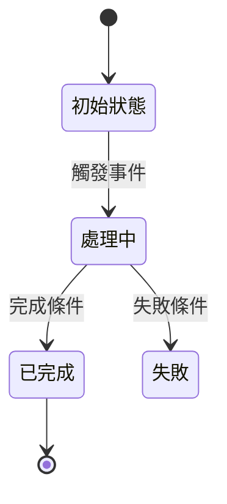
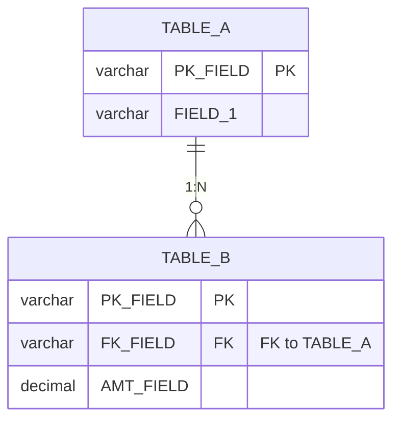

# {功能名稱} 系統分析文件

<!--
  文件定位：
  - 本文件為「系統分析文件」(SAD - System Analysis Document)
  - 前置文件：功能需求文件 (FRD) 定義了 What 和 Why
  - 本文件定義：How to Realize — 從工作流、資訊流、資料流角度分析如何實現需求
  - 後續文件：後端功能規格書 (BFS) 定義技術實作細節

  核心原則：
  1. 以系統分析師視角，橋接「業務需求」與「技術實作」
  2. 深入理解現有系統邏輯與流程，找出可重用資源
  3. 從三流（工作流、資訊流、資料流）角度完整分析
  4. 提供明確的實現策略建議，降低後續規格書撰寫的不確定性
-->

---

## 文件資訊

| 項目 | 內容 |
|------|------|
| 文件編號 | SAD-{模組代號}-{序號} |
| 版本 | 1.0 |
| 狀態 | 草稿 / 審查中 / 已核准 |
| 建立日期 | YYYY-MM-DD |
| 最後更新 | YYYY-MM-DD |
| 撰寫者 | {姓名} |
| 對應需求文件 | FRD-{編號} v{版本} |

---

## 1. 分析摘要

### 1.1 功能概述

| 項目 | 說明 |
|------|------|
| 功能名稱 | {功能名稱} |
| 所屬模組 | {模組} |
| 對應需求 | FRD-{編號} |
| MES 生命週期位置 | {設計/開模/試模/量產/維修/報廢} |

### 1.2 分析結論

<!--
  SA 的核心結論：這個需求可行嗎？難度在哪？關鍵決策是什麼？
-->

| 項目 | 評估 |
|------|------|
| 技術可行性 | ✅ 可行 / ⚠️ 有條件可行 / ❌ 不可行 |
| 實現複雜度 | 低 / 中 / 高 |
| 與現有系統整合度 | 高（大量重用）/ 中（部分重用）/ 低（幾乎全新） |
| 關鍵風險 | {一句話描述最大風險} |

---

## 2. 工作流分析

<!--
  工作流 = 「誰」在「什麼時候」做「什麼事」，系統如何支撐
  重點：角色互動、狀態流轉、系統自動化邊界
-->

### 2.1 業務流程與系統支撐

```mermaid
flowchart TD
    subgraph 使用者操作
        A[{步驟1}] --> B{決策點}
    end

    subgraph 系統處理
        B -->|條件A| C[系統動作1]
        B -->|條件B| D[系統動作2]
        C --> E[更新資料]
    end

    subgraph 後續流程
        E --> F[通知/觸發下游]
    end
```

### 2.2 角色與系統互動

| 步驟 | 角色 | 操作 | 系統支撐 | 前置條件 | 產出 |
|------|------|------|---------|---------|------|
| 1 | {角色} | {操作描述} | {系統提供什麼} | {需要什麼才能開始} | {完成後產出什麼} |
| 2 | 系統 | {自動處理} | — | {觸發條件} | {處理結果} |

### 2.3 狀態流轉（若適用）



| 狀態 | 說明 | 允許操作 | 觸發條件 |
|------|------|---------|---------|
| {狀態} | {說明} | {可執行的操作} | {進入此狀態的條件} |

---

## 3. 資訊流分析

<!--
  資訊流 = 資料「從哪來」→「經過什麼處理」→「到哪去」
  重點：資料來源、轉換邏輯、輸出目標
-->

### 3.1 資訊流向圖

```mermaid
flowchart LR
    subgraph 資料來源
        S1[{來源1: 使用者輸入}]
        S2[{來源2: 現有資料表}]
        S3[{來源3: 外部系統}]
    end

    subgraph 處理邏輯
        P1[驗證]
        P2[轉換/計算]
        P3[業務規則]
    end

    subgraph 資料目標
        T1[{目標1: 寫入資料表}]
        T2[{目標2: 回傳前端}]
        T3[{目標3: 觸發通知}]
    end

    S1 --> P1 --> P2
    S2 --> P2
    P2 --> P3
    S3 --> P3
    P3 --> T1
    P3 --> T2
    P3 --> T3
```

### 3.2 資訊處理明細

| 編號 | 資訊項目 | 來源 | 處理邏輯 | 目標 | 備註 |
|------|---------|------|---------|------|------|
| IF-01 | {資訊項目} | {來源} | {如何處理/轉換} | {儲存或輸出到哪} | {補充} |

### 3.3 系統整合介面（若適用）

| 編號 | 來源系統 | 目標系統 | 傳輸方式 | 資料內容 | 頻率 |
|------|---------|---------|---------|---------|------|
| INT-01 | {系統A} | 本系統 | REST API / 批次 | {資料描述} | 即時/定時 |

---

## 4. 資料流分析

<!--
  資料流 = 涉及哪些 DB 表、讀寫關係、表間關聯
  重點：資料模型、表關聯、CRUD 操作對應
-->

### 4.1 涉及資料表

| 資料表 | Schema | 讀/寫 | 用途說明 | 現有/新建 |
|--------|--------|-------|---------|----------|
| {表名} | {dbo/Tool/...} | R / W / RW | {在本功能中的用途} | 現有 / 新建 |

### 4.2 資料模型關聯圖



### 4.3 CRUD 操作對應

| 操作 | 主資料表 | 關聯資料表 | 業務規則 | 備註 |
|------|---------|-----------|---------|------|
| Create | {表} | {關聯表} | {新增時的規則} | |
| Read | {表} | {JOIN 的表} | {查詢條件} | |
| Update | {表} | {連動更新的表} | {更新時的規則} | |
| Delete | {表} | {級聯影響的表} | {刪除限制} | |

### 4.4 資料影響評估

| 變更項目 | 影響範圍 | 現有資料量 | 遷移需求 | 風險等級 |
|---------|---------|-----------|---------|---------|
| {新增表/欄位/FK} | {影響哪些模組} | {筆數} | 是/否 | 低/中/高 |

---

## 5. 現有系統重用分析

<!--
  SA 最大的價值：找出現有系統中可重用的資源，避免重複開發
-->

### 5.1 可重用 API

| 現有 API | 路由 | 重用方式 | 備註 |
|---------|------|---------|------|
| {Controller.Action} | `/api/v3/{area}/{entity}/{action}` | 直接使用 / 需擴充 | {說明} |

### 5.2 可重用 Entity / Repository

| 現有資源 | 路徑 | 重用方式 | 備註 |
|---------|------|---------|------|
| {Entity 名稱} | `Domain/Entities/{path}` | 直接使用 / 需擴充欄位 | {說明} |
| {Repository 名稱} | `Persistence/Repositories/{path}` | 直接使用 / 需新增方法 | {說明} |

### 5.3 可重用 Light API（下拉選單）

| 選單用途 | 現有 Light API | 是否存在 | 備註 |
|---------|---------------|---------|------|
| {選單名稱} | `Get{Entity}Light` | ✅ / ❌ 需新建 | {說明} |

### 5.4 需新建資源清單

| 類型 | 名稱 | 說明 |
|------|------|------|
| Entity | {名稱} | {用途} |
| Repository | {名稱} | {用途} |
| Handler | {名稱} | {用途} |
| Controller | {名稱} | {用途} |

---

## 6. 實現策略建議

<!--
  給規格書撰寫的技術方向建議，降低規格書撰寫的不確定性
-->

### 6.1 技術方案

| 決策項目 | 建議方案 | 理由 |
|---------|---------|------|
| {決策1: 例如資料查詢方式} | {EF Core / Dapper} | {為什麼選這個} |
| {決策2: 例如是否需要新表} | {方案} | {理由} |

### 6.2 實作優先順序建議

| 順序 | 項目 | 依賴 | 說明 |
|------|------|------|------|
| 1 | {第一步} | 無 | {為什麼先做這個} |
| 2 | {第二步} | 步驟 1 | {說明} |

### 6.3 風險與待決事項

| 編號 | 風險/議題 | 影響程度 | 建議處理方式 | 狀態 |
|------|---------|---------|-------------|------|
| R-01 | {風險描述} | 高/中/低 | {建議} | 待確認 / 已確認 |

---

## 撰寫指南

### A. 三流分析核心問題

| 分析維度 | 核心問題 |
|---------|---------|
| 工作流 | 誰在什麼時候做什麼？系統如何支撐？狀態如何流轉？ |
| 資訊流 | 資料從哪來？經過什麼處理？到哪去？ |
| 資料流 | 涉及哪些 DB 表？讀寫關係？表間關聯？ |

### B. 分析深度指引

| 功能複雜度 | 工作流 | 資訊流 | 資料流 | 重用分析 |
|-----------|--------|--------|--------|---------|
| 簡單 CRUD | 簡化 | 簡化 | 必填 | 必填 |
| 多步驟流程 | 完整 | 完整 | 必填 | 必填 |
| 跨模組整合 | 完整 | 完整 | 完整 | 完整 |

### C. 圖表使用時機

| 圖形類型 | 使用時機 |
|---------|---------|
| 流程圖 (Flowchart) | 呈現業務步驟與系統處理的對應 |
| 狀態圖 (State Diagram) | 資料有多種狀態轉換時 |
| 資訊流向圖 (Flowchart LR) | 呈現資料來源→處理→目標 |
| ER 圖 (erDiagram) | 呈現資料表關聯 |
| 時序圖 (Sequence Diagram) | 多系統互動時（系統整合場景） |
